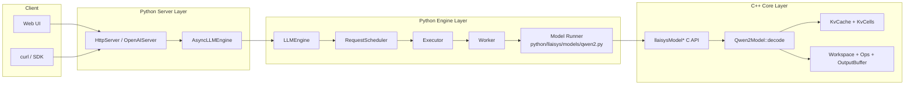
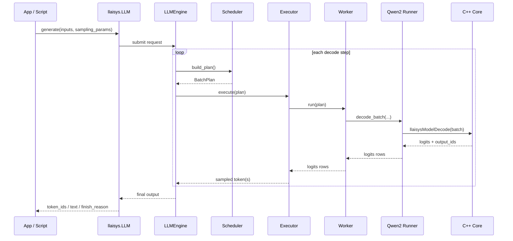
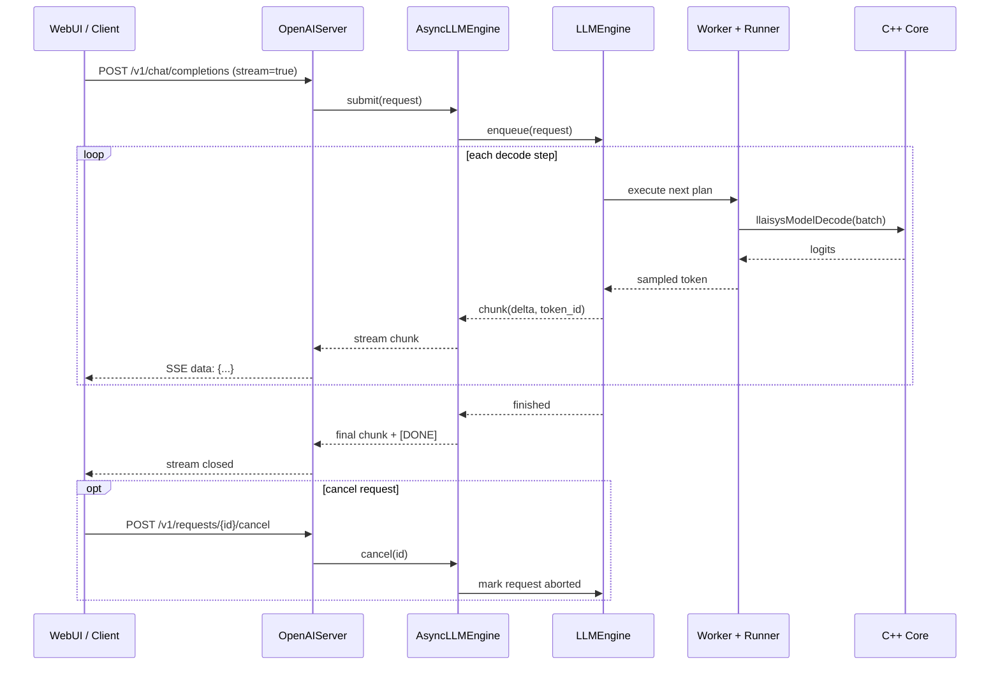
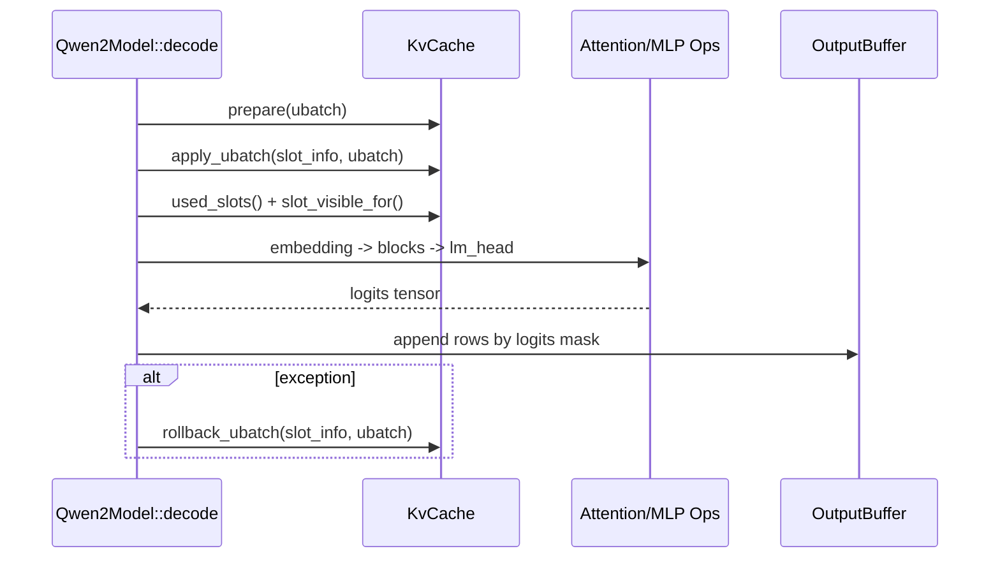

# NovaInfer

## Current Status

Core/runtime:

- `llaisysModelDecode` runs true batched decode (no per-token `infer(..., 1)` loop).
- KV cache supports both `block` and `slot` layouts.
- Prefix-sharing semantics are enabled in block layout via shared slot metadata.
- NVIDIA paged attention backend is selectable via environment:
  - `LLAISYS_CUDA_PAGED_ATTN_BACKEND=native`
  - `LLAISYS_CUDA_PAGED_ATTN_BACKEND=cudnn`

Server/streaming:

- OpenAI-compatible chat API supports non-stream and SSE stream.
- Reasoning/content are parsed into separate fields (`reasoning`, `content`) in OpenAI responses.
- Async stream race issues (late subscribe losing prefix tokens / terminal chunk before last token) have been fixed.

Testing/CI:

- Pytest supports axis filtering: `--device`, `--layout`, `--backend`.
- Real-model parity covers CPU and NVIDIA paths; NVIDIA includes `native` and `cudnn`.
- CI model is aligned to `deepseek-ai/DeepSeek-R1-Distill-Qwen-1.5B`.

Known limits:

- Sliding-window KV policy is not implemented yet.
- Attention kernel path is functional-first; `cudnn` backend is still being optimized vs `native`/vLLM-class kernels.

## System Architecture & Sequence

### Layered Architecture



### Offline Sequence (`LLM.generate`)



### Online Streaming Sequence (SSE)



### Core Decode Internal Sequence



## Build

### 1. Build native library
Install compile tool - xmake
```bash
curl -fsSL https://xmake.io/shget.text | bash
source ~/.xmake/profile
```
CPU (Linux):

```bash
xmake f --mode=release --nv-gpu=n
xmake -j
xmake install
```

NVIDIA CUDA:

```bash
xmake f --mode=release --nv-gpu=y
xmake -j
xmake install
```

NVIDIA CUDA + cuDNN frontend (for `LLAISYS_CUDA_PAGED_ATTN_BACKEND=cudnn`):

```bash
git submodule update --init --recursive
xmake f --mode=release --nv-gpu=y --nv-cudnn=y
xmake -j
xmake install
```

Notes:

- `xmake f ...` configures build mode/options; rerun it when switching CPU/GPU/cudnn.
- `xmake install` is required so Python loads the latest library from `python/llaisys/libllaisys/`.
- If `third_party/cudnn_frontend` submodule is missing, cuDNN frontend build path will not be available.

### 2. Install Python package

```bash
pip install -e ./python[test]
```

`[test]` extra installs pytest and related deps.

## Run Inference Services

### 1. Start API server

CPU backend:

```bash
PYTHONPATH=python python -m llaisys.server \
  --model-path models/DeepSeek-R1-Distill-Qwen-1.5B \
  --model-type qwen2 \
  --device cpu \
  --kv-cache-capacity-mode auto \
  --kv-cache-memory-utilization 0.9 \
  --host 127.0.0.1 \
  --port 8000 \
  --verbose
```

NVIDIA backend (native paged attention):

```bash
CUDA_VISIBLE_DEVICES=0 \
PYTHONPATH=python python -m llaisys.server \
  --model-path models/DeepSeek-R1-Distill-Qwen-1.5B \
  --model-type qwen2 \
  --device nvidia \
  --kv-cache-capacity-mode auto \
  --kv-cache-memory-utilization 0.9 \
  --host 127.0.0.1 \
  --port 8000 \
  --verbose
```

NVIDIA backend (cuDNN paged attention):

```bash
CUDA_VISIBLE_DEVICES=0 \
LLAISYS_CUDA_PAGED_ATTN_BACKEND=cudnn \
PYTHONPATH=python python -m llaisys.server \
  --model-path models/DeepSeek-R1-Distill-Qwen-1.5B \
  --model-type qwen2 \
  --device nvidia \
  --kv-cache-capacity-mode auto \
  --kv-cache-memory-utilization 0.9 \
  --host 127.0.0.1 \
  --port 8000 \
  --verbose
```

Available endpoints:

- `GET /health`
- `POST /v1/chat/completions`
- `POST /v1/requests/{request_id}/cancel`

### 2. Start Web UI static server

```bash
python -m http.server 8081 -d webui
```

Open `http://127.0.0.1:8081` and set server URL to `http://127.0.0.1:8000`.

Backend selection summary:

- `--device cpu`: CPU runner (no CUDA backend switch).
- `--device nvidia` + no env `LLAISYS_CUDA_PAGED_ATTN_BACKEND`: default native paged attention backend.
- `--device nvidia` + `LLAISYS_CUDA_PAGED_ATTN_BACKEND=cudnn`: cuDNN paged attention backend.

## Manual API Debug

Non-stream:

```bash
curl -s http://127.0.0.1:8000/v1/chat/completions \
  -H "Content-Type: application/json" \
  -d '{"model":"qwen2","messages":[{"role":"user","content":"hello"}],"stream":false,"max_tokens":32}'
```

Stream (SSE):

```bash
curl -N http://127.0.0.1:8000/v1/chat/completions \
  -H "Content-Type: application/json" \
  -d '{"model":"qwen2","messages":[{"role":"user","content":"hello"}],"stream":true,"max_tokens":32}'
```

Cancel request:

```bash
curl -s -X POST http://127.0.0.1:8000/v1/requests/<request_id>/cancel
```

## Run Tests

### 1. Test axis filters

`pytest` supports these global filters:

- `--device {all,cpu,nvidia}`
- `--layout {all,slot,block}`
- `--backend {all,native,cudnn}`
- `--model-path <local_model_dir>` for tests marked `requires_model`

Examples:

Run all CPU + native + block tests:

```bash
PYTHONPATH=python python -m pytest -q --device cpu --layout block --backend native
```

Run only NVIDIA + cuDNN tests:

```bash
PYTHONPATH=python python -m pytest -q \
  --model-path models/DeepSeek-R1-Distill-Qwen-1.5B \
  --device nvidia --layout block --backend cudnn
```

### 2. Recommended smoke commands

Core/offline/online (no real model):

```bash
PYTHONPATH=python python -m pytest -q \
  test/core \
  test/engine \
  test/offline \
  test/online/test_online.py \
  test/online/test_online_http.py \
  test/online/test_online_stream_isolation.py \
  --device cpu --layout block --backend native
```

Parity (real model):

```bash
PYTHONPATH=python python -m pytest -q \
  test/parity/test_core_parity.py \
  test/parity/test_offline_parity.py \
  test/parity/test_infer.py \
  --model-path models/DeepSeek-R1-Distill-Qwen-1.5B \
  --device all --layout all --backend all
```

Online real-model regression:

```bash
PYTHONPATH=python python -m pytest -q \
  test/online/test_online_real_model_multisession.py \
  --model-path models/DeepSeek-R1-Distill-Qwen-1.5B \
  --device nvidia --layout block --backend all
```

### 3. CI helper script (optional)

```bash
python scripts/run_tests.py --suite all --run-parity never --run-hf never
python scripts/run_tests.py --suite stage2 --model-path models/DeepSeek-R1-Distill-Qwen-1.5B
```

## Notes

- If Web UI loads but cannot call API, check server URL and CORS-enabled API process.
- `favicon.ico 404` from `python -m http.server` is harmless.
- In restricted sandbox environments, HTTP bind tests may be skipped automatically.
- If `test/test_online_http.py` fails with `http.client.RemoteDisconnected`, check proxy environment variables (`HTTP_PROXY`, `HTTPS_PROXY`, `ALL_PROXY`).
  The HTTP tests now disable proxies explicitly (via `urllib.request.ProxyHandler({})`) to force localhost direct connection.
