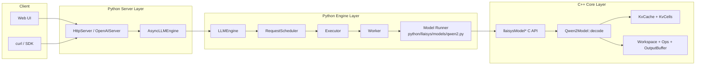
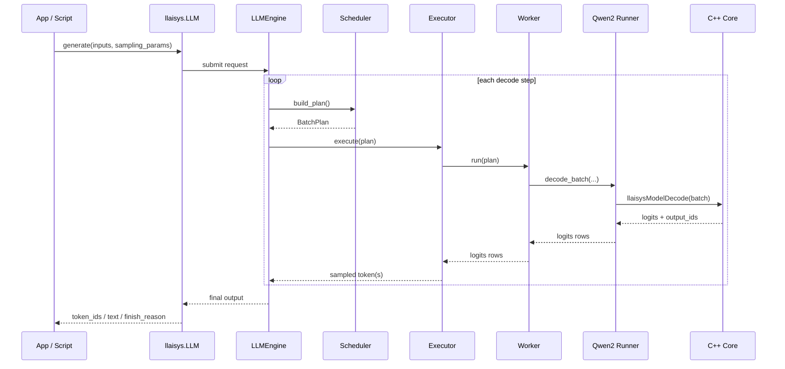
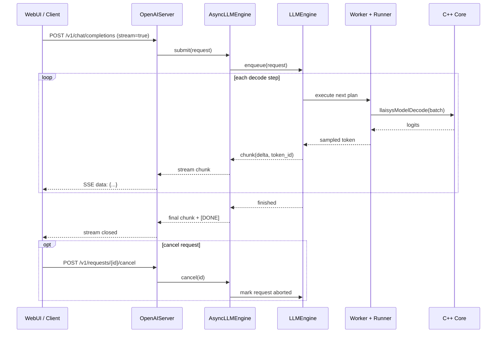
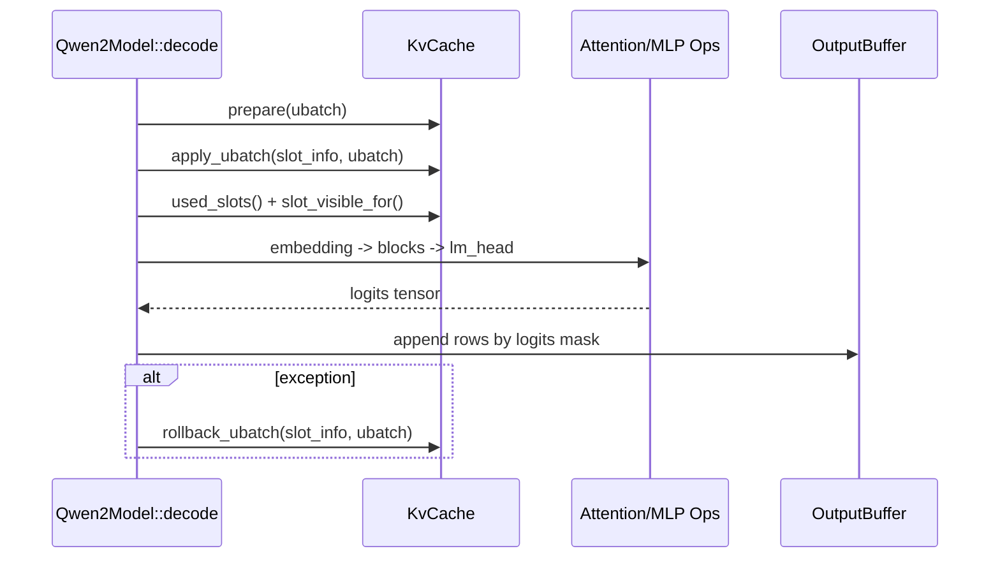

# NovaInfer

## Current Status (As-Built, 2026-02-11)

Core (C++) current state:

- `llaisysModelDecode` now executes one real batch step (no per-token `infer(..., 1)` loop).
- KV cache is unified cell-first metadata:
  - one slot can be attached to multiple `seq_id` (shared prefix semantics);
  - decode path supports `n_seq_id > 1` per token.
- attention isolation for mixed sequences is mask-based in one forward pass:
  - visibility rule = `intersect(query_seq_ids, slot_seq_ids) && slot_pos <= query_pos`.
- C API surface is unchanged (`llaisysModel*`), so Python/Engine call sites remain compatible.

Known limits (still true):

- Sliding-window KV policy is not implemented.
- current masked attention path is correctness-first; performance optimization is stage-3 scope.

## System Architecture & Sequence

### Layered Architecture



### Offline Sequence (`LLM.generate`)



### Online Streaming Sequence (SSE)



### Core Decode Internal Sequence



## Quick Start

### 1. Build native library

Linux/macOS (CPU):

```bash
xmake f -m release --nv-gpu=n
xmake
xmake install
```

Linux (CUDA/NVIDIA):

```bash
xmake f -m release --nv-gpu=y
xmake
xmake install
```

Linux (CUDA/NVIDIA + cuDNN backend scaffolding):

```bash
xmake f -m release --nv-gpu=y --nv-cudnn=y
xmake
xmake install
```

If `third_party/cudnn_frontend/include` exists, build enables `ENABLE_CUDNN_FRONTEND` automatically.
This is the expected path for implementing real cuDNN SDPA paged attention.

Notes:

- `--nv-gpu` is a configure option, so run it with `xmake f ...` first.
- `--nv-cudnn` is optional and only meaningful together with `--nv-gpu=y`.
- `xmake --nv-gpu ...` is not a valid replacement for `xmake f --nv-gpu=...`.
- If you switch between CPU/CUDA modes, rerun `xmake f ...` to refresh config.

The install step copies the shared library into `python/llaisys/libllaisys/`.
If you run `xmake` only, the new `.so/.dylib` is generated under `build/...` and may not be the one Python loads.
In that case, run `xmake install` (recommended) or copy the built library to `python/llaisys/libllaisys/` manually.

### 2. Install Python package

```bash
pip install -e ./python[test]
```

`pytest` is configured as a test extra (not a base dependency).
If you run only `pip install -e ./python`, test dependencies such as `pytest` will not be installed.

### 3. Run tests (pytest)

Run all default tests:

```bash
pytest
```

Run parity tests with local model path:

```bash
pytest -vv --model-path models/DeepSeek-R1-Distill-Qwen-1.5B -m parity
```

Run real-model multi-session stream regression (reproduces WebUI concurrent chat path):

```bash
pytest -vv test/test_online_real_model_multisession.py \
  --model-path models/DeepSeek-R1-Distill-Qwen-1.5B
```

Run stage suites:

```bash
python scripts/run_tests.py --suite stage0 --run-parity never --run-hf never
python scripts/run_tests.py --suite stage1 --run-parity never
python scripts/run_tests.py --suite stage2
```

## macOS Notes

- Current macOS support is CPU-only (`--device cpu`).
- NVIDIA/CUDA path is not available on macOS.
- After `xmake install`, verify native library is present:

```bash
ls python/llaisys/libllaisys/libllaisys.dylib
```

- Quick sanity check:

```bash
PYTHONPATH=python python -c "import llaisys; print('ok')"
```

## Run Inference Services

### 1. Start API server

CPU:

```bash
PYTHONPATH=python python -m llaisys.server \
  --model-path models/DeepSeek-R1-Distill-Qwen-1.5B \
  --model-type qwen2 \
  --device cpu \
  --kv-cache-capacity-mode auto \
  --kv-cache-memory-utilization 0.9 \
  --host 127.0.0.1 \
  --port 8000 \
  --verbose
```

NVIDIA (native paged attention):

```bash
CUDA_VISIBLE_DEVICES=0 \
PYTHONPATH=python python -m llaisys.server \
  --model-path models/DeepSeek-R1-Distill-Qwen-1.5B \
  --model-type qwen2 \
  --device nvidia \
  --kv-cache-capacity-mode auto \
  --kv-cache-memory-utilization 0.9 \
  --host 127.0.0.1 \
  --port 8000 \
  --verbose
```

NVIDIA (cuDNN paged attention backend):

```bash
CUDA_VISIBLE_DEVICES=0 \
LLAISYS_CUDA_PAGED_ATTN_BACKEND=cudnn \
PYTHONPATH=python python -m llaisys.server \
  --model-path models/DeepSeek-R1-Distill-Qwen-1.5B \
  --model-type qwen2 \
  --device nvidia \
  --kv-cache-capacity-mode auto \
  --kv-cache-memory-utilization 0.9 \
  --host 127.0.0.1 \
  --port 8000 \
  --verbose
```

Available endpoints:

- `GET /health`
- `POST /v1/chat/completions`
- `POST /v1/requests/{request_id}/cancel`

### 2. Start Web UI static server

```bash
python -m http.server 8081 -d webui
```

Open `http://127.0.0.1:8081` and set server URL to `http://127.0.0.1:8000`.

## Manual API Debug

Non-stream:

```bash
curl -s http://127.0.0.1:8000/v1/chat/completions \
  -H "Content-Type: application/json" \
  -d '{"model":"qwen2","messages":[{"role":"user","content":"hello"}],"stream":false,"max_tokens":32}'
```

Stream (SSE):

```bash
curl -N http://127.0.0.1:8000/v1/chat/completions \
  -H "Content-Type: application/json" \
  -d '{"model":"qwen2","messages":[{"role":"user","content":"hello"}],"stream":true,"max_tokens":32}'
```

Cancel request:

```bash
curl -s -X POST http://127.0.0.1:8000/v1/requests/<request_id>/cancel
```

## Notes

- If Web UI loads but cannot call API, check server URL and CORS-enabled API process.
- `favicon.ico 404` from `python -m http.server` is harmless.
- In restricted sandbox environments, HTTP bind tests may be skipped automatically.
- If `test/test_online_http.py` fails with `http.client.RemoteDisconnected`, check proxy environment variables (`HTTP_PROXY`, `HTTPS_PROXY`, `ALL_PROXY`).
  The HTTP tests now disable proxies explicitly (via `urllib.request.ProxyHandler({})`) to force localhost direct connection.
