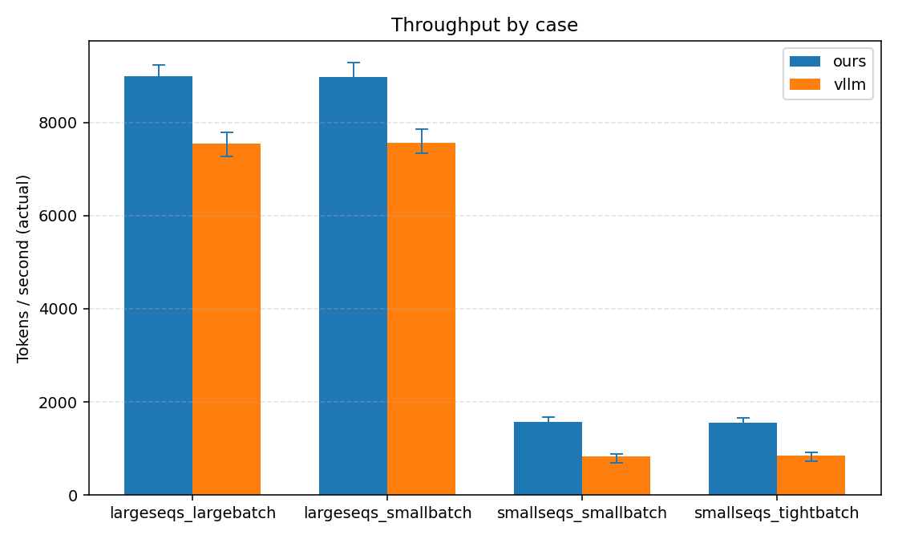
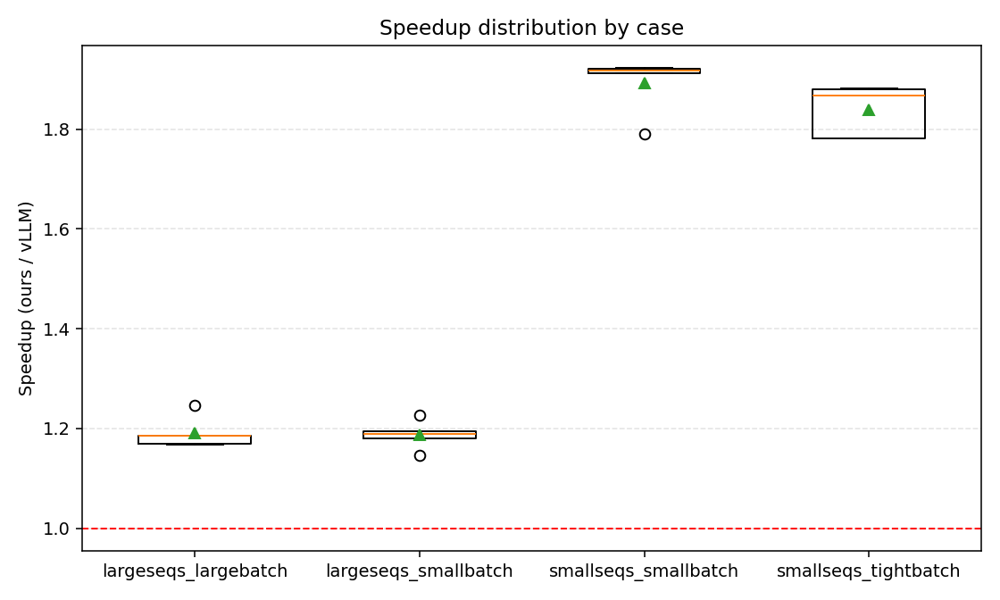
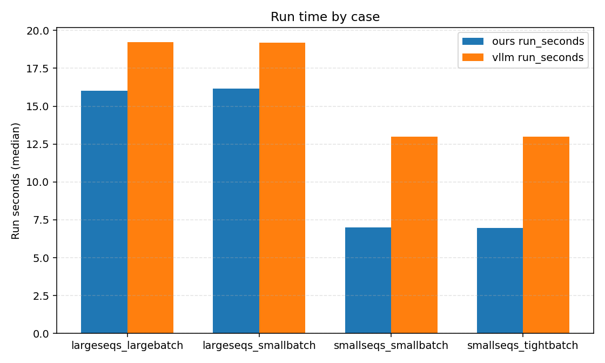
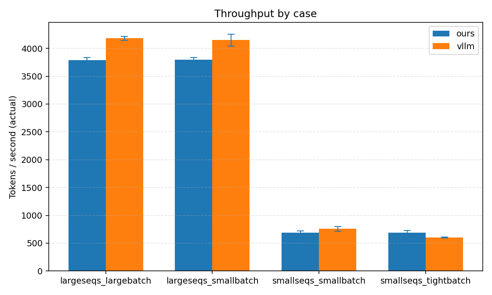
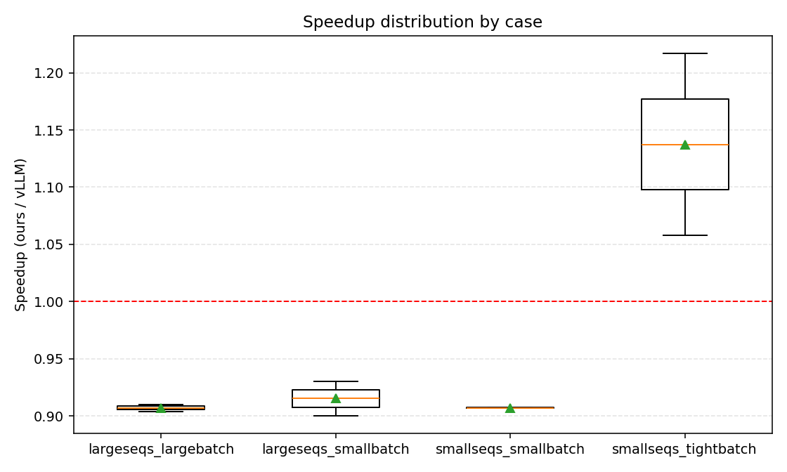
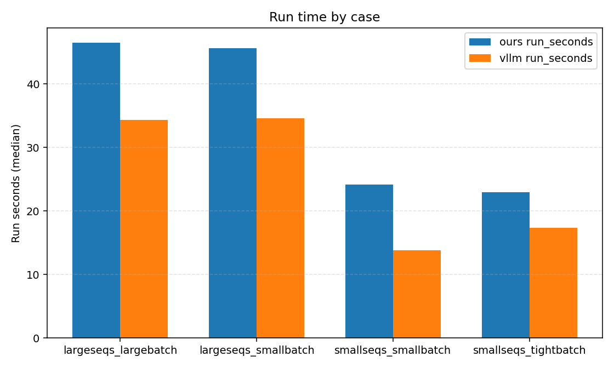
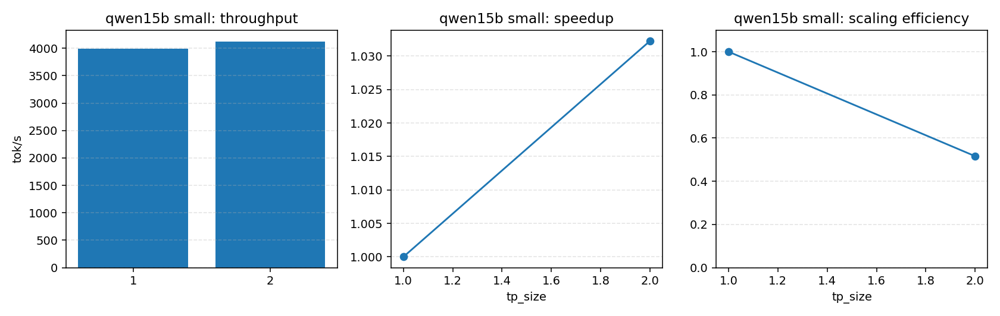
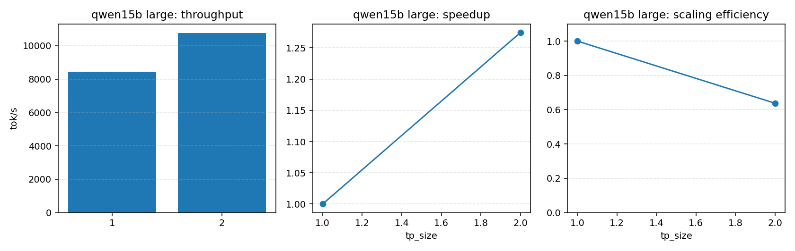
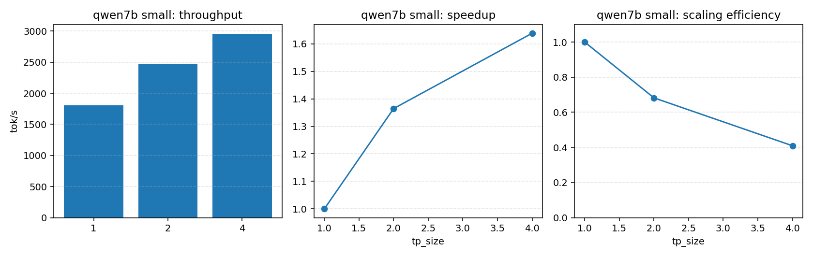
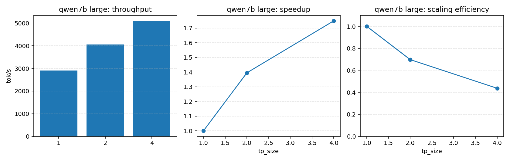

# NovaInfer A100 性能验证（2026-03-14）

本文记录当前 NovaInfer 在 A100 集群上的性能验证结果，分为两部分：

1. 单卡 A100 上的 NovaInfer vs vLLM 通用基准，对齐 `doc/novainfer_vs_vllm_perf_experiment_2026-03-12.md` 的 3090 口径。
2. 多卡 A100 上的 NovaInfer Tensor Parallel 吞吐扩展矩阵。
3. 内建 `mp executor` 与历史外部 launcher `uni` 基线的 TP 对齐验证。

## 1. 目标

1. 给出与 3090 文档可横向对比的 A100 单卡数据。
2. 验证当前 TP 实现的吞吐收益与扩展效率。
3. 固化当前正确性与性能同时成立的 A100 基线。

## 2. 测试环境

### 2.1 硬件与软件

- GPU: `NVIDIA A100-SXM4-80GB`
- GPU 数量: `8`
- 单卡显存: `81920 MiB`
- Driver: `570.133.20`
- CUDA toolkit: `12.8`（`/usr/local/cuda/bin/nvcc`, `Build cuda_12.8.r12.8/compiler.35404655_0`）
- cuDNN 运行时: `9.18.1`（`cudnnGetVersion() = 91801`）
- NCCL 动态库来自 Python 环境：`.../.venv/lib/python3.12/site-packages/nvidia/nccl/lib`

### 2.2 环境变量

```bash
export CUDNN_HOME=/home/xiaohajiayou/opt/cudnn-linux-x86_64-9.18.1.3_cuda12-archive
export LD_LIBRARY_PATH="$CUDNN_HOME/lib:/home/xiaohajiayou/NovaInfer/.venv/lib/python3.12/site-packages/nvidia/nccl/lib:${LD_LIBRARY_PATH:-}"
export LLAISYS_CUDA_PAGED_ATTN_BACKEND=cudnn
```

说明：

1. bench 脚本已打印运行时 `backend/CUDA_VISIBLE_DEVICES/CUDNN_HOME/LD_LIBRARY_PATH` 摘要。
2. TP bench 输出口径已统一为：`global_tokens / max(rank_run_seconds)`。

## 3. 单卡 NovaInfer vs vLLM（A100）

### 3.1 工作负载

与 3090 文档对齐，使用 `scripts/run_perf_experiments.py` 的四组 case，模型固定为 `DeepSeek-R1-Distill-Qwen-1.5B`：

1. `smallseqs_tightbatch`
2. `smallseqs_smallbatch`
3. `largeseqs_smallbatch`
4. `largeseqs_largebatch`

统一条件：

1. `CUDA_VISIBLE_DEVICES=5`
2. `repeats=5`
3. `seed_base=3000`
4. `LLAISYS_CUDA_PAGED_ATTN_BACKEND=cudnn`
5. vLLM 侧使用 fair-mode

### 3.2 运行命令

```bash
CUDA_VISIBLE_DEVICES=5 \
.venv/bin/python scripts/run_perf_experiments.py \
  --model-path /home/xiaohajiayou/NovaInfer/models/deepseek-ai/DeepSeek-R1-Distill-Qwen-1.5B \
  --repeats 5 \
  --seed-base 3000 \
  --cases smallseqs_tightbatch smallseqs_smallbatch largeseqs_smallbatch largeseqs_largebatch \
  --backend-order novainfer vllm \
  --cudnn-backend cudnn \
  --output-jsonl perf_results_a100_2026-03-14.jsonl \
  --output-log-dir perf_logs_a100_2026-03-14
```

### 3.3 原始数据与图表

- 原始数据：`perf_results_a100_2026-03-14.jsonl`
- 原始日志：`perf_logs_a100_2026-03-14/`
- 图表目录：`perf_plots_a100_2026-03-14/`

### 图：各场景吞吐



### 图：加速比分布（ours / vLLM）



### 图：运行时长（run_seconds）



### 3.4 中位数结果

| 场景 | ours | vLLM | 比值（ours/vLLM） |
|---|---:|---:|---:|
| `smallseqs_tightbatch` | 1629.20 | 868.98 | 1.875x |
| `smallseqs_smallbatch` | 1626.08 | 847.07 | 1.920x |
| `largeseqs_smallbatch` | 9016.73 | 7396.15 | 1.219x |
| `largeseqs_largebatch` | 9060.16 | 7524.85 | 1.204x |

### 3.5 重复实验明细

#### `smallseqs_tightbatch`

| repeat | ours | vLLM | 比值 |
|---:|---:|---:|---:|
| 0 | 1300.76 | 729.93 | 1.782x |
| 1 | 1661.68 | 889.40 | 1.868x |
| 2 | 1634.55 | 868.98 | 1.881x |
| 3 | 1549.59 | 824.40 | 1.880x |
| 4 | 1629.20 | 914.74 | 1.781x |

#### `smallseqs_smallbatch`

| repeat | ours | vLLM | 比值 |
|---:|---:|---:|---:|
| 0 | 1337.66 | 697.88 | 1.917x |
| 1 | 1669.93 | 873.29 | 1.912x |
| 2 | 1626.08 | 846.44 | 1.921x |
| 3 | 1585.13 | 885.19 | 1.791x |
| 4 | 1628.28 | 847.07 | 1.922x |

#### `largeseqs_smallbatch`

| repeat | ours | vLLM | 比值 |
|---:|---:|---:|---:|
| 0 | 9052.48 | 7374.63 | 1.228x |
| 1 | 8769.37 | 7345.94 | 1.194x |
| 2 | 8722.80 | 7396.15 | 1.179x |
| 3 | 9016.73 | 7862.96 | 1.147x |
| 4 | 9289.87 | 7809.53 | 1.190x |

#### `largeseqs_largebatch`

| repeat | ours | vLLM | 比值 |
|---:|---:|---:|---:|
| 0 | 9060.16 | 7265.12 | 1.247x |
| 1 | 8798.81 | 7524.85 | 1.169x |
| 2 | 8795.30 | 7423.59 | 1.185x |
| 3 | 9067.08 | 7767.11 | 1.167x |
| 4 | 9227.05 | 7780.36 | 1.186x |

### 3.6 与 3090 结果对比的直接观察

对比 `doc/novainfer_vs_vllm_perf_experiment_2026-03-12.md`：

1. 在 3090 上，小负载 ours 优势明显，大负载基本持平。
2. 在当前 A100 上，ours 在四组 workload 中全部领先 vLLM。
3. 尤其在大负载场景下，A100 上 ours 仍保持约 `1.20x` 的优势，而不是收敛到 1.0 附近。

当前更合理的解释是：

1. A100 上 `BLOCK + cuDNN` 主路径的收益释放得更充分。
2. 当前版本在 Python metadata、cuDNN plan 稳定性、KV/TP 结构清理后，ours 单卡链路相比 3090 文档对应版本已更成熟。

### 3.7 单卡 7B 补充验证（A100）

说明：

1. 7B 在当前共享 A100 集群上，vLLM 会因为启动时显存水位波动而中断部分重复实验。
2. 因此这里采用 `perf_logs_a100_qwen7b_2026-03-14_v85/` 中四个 case 都完整覆盖的公共子集 `rep0-1`。
3. 该组结果只用于补充单卡 7B 对比趋势，不替代 1.5B 的主基线统计。

重建结果文件与图表：

- 原始日志：`perf_logs_a100_qwen7b_2026-03-14_v85/`
- 重建结果：`perf_results_a100_qwen7b_2026-03-14_common2.jsonl`
- 图表目录：`perf_plots_a100_qwen7b_2026-03-14_common2/`

### 图：7B 各场景吞吐



### 图：7B 加速比分布（ours / vLLM）



### 图：7B 运行时长（run_seconds）



#### 7B 中位数结果（公共子集 2 repeats）

| 场景 | ours | vLLM | 比值（ours/vLLM） |
|---|---:|---:|---:|
| `smallseqs_tightbatch` | 685.54 | 603.17 | 1.137x |
| `smallseqs_smallbatch` | 686.06 | 756.42 | 0.907x |
| `largeseqs_smallbatch` | 3796.44 | 4150.38 | 0.915x |
| `largeseqs_largebatch` | 3790.51 | 4179.34 | 0.907x |

#### 7B 重复实验明细（公共子集 2 repeats）

##### `smallseqs_tightbatch`

| repeat | ours | vLLM | 比值 |
|---:|---:|---:|---:|
| 0 | 726.41 | 597.01 | 1.217x |
| 1 | 644.66 | 609.33 | 1.058x |

##### `smallseqs_smallbatch`

| repeat | ours | vLLM | 比值 |
|---:|---:|---:|---:|
| 0 | 723.54 | 798.15 | 0.907x |
| 1 | 648.57 | 714.69 | 0.907x |

##### `largeseqs_smallbatch`

| repeat | ours | vLLM | 比值 |
|---:|---:|---:|---:|
| 0 | 3760.87 | 4044.16 | 0.930x |
| 1 | 3832.01 | 4256.60 | 0.900x |

##### `largeseqs_largebatch`

| repeat | ours | vLLM | 比值 |
|---:|---:|---:|---:|
| 0 | 3743.02 | 4141.34 | 0.904x |
| 1 | 3837.99 | 4217.35 | 0.910x |

#### 7B 单卡结果解读

1. 当前共享 A100 集群条件下，7B 单卡对比没有复现 1.5B 上的全面领先。
2. `smallseqs_tightbatch` 上 ours 仍领先 vLLM；其余三个 case 中，vLLM 的中位数更高。
3. 这组结果来自公共完整子集，仅有 `2` 次重复，统计稳定性弱于 1.5B 主基线。
4. 因此 7B 单卡结果应视为“当前共享集群水位下的补充观测”，不单独作为版本退化结论。

## 4. TP 吞吐扩展（A100）

### 4.1 矩阵设计

模型：

1. `DeepSeek-R1-Distill-Qwen-1.5B`
2. `DeepSeek-R1-Distill-Qwen-7B`

负载：

1. `small`
2. `large`

TP：

1. `1.5B`: `tp=1,2`
2. `7B`: `tp=1,2,4`

### 4.2 口径

1. TP 吞吐统一取：
   - `global_tokens / max(rank_run_seconds)`
2. speedup 统一相对同模型、同负载、`tp=1` 基线。
3. scaling efficiency 定义为：
   - `speedup / tp_size`
4. 所有 TP 结果默认建立在 HF parity 已通过的前提上。

### 4.3 运行命令

```bash
.venv/bin/python scripts/run_tp_perf_experiments.py \
  --repeats 3 \
  --seed-base 4000 \
  --output-jsonl tp_perf_results_a100_2026-03-14.jsonl \
  --output-log-dir tp_perf_logs_a100_2026-03-14
```

### 4.4 原始数据与图表

- 原始数据：`tp_perf_results_a100_2026-03-14.jsonl`
- 原始日志：`tp_perf_logs_a100_2026-03-14/`
- 图表目录：`tp_perf_plots_a100_2026-03-14/`

### 图：1.5B small TP 扩展



### 图：1.5B large TP 扩展



### 图：7B small TP 扩展



### 图：7B large TP 扩展



### 4.5 TP 中位数结果

#### 1.5B

| 负载 | tp_size | 中位数吞吐 | speedup vs tp1 | scaling efficiency |
|---|---:|---:|---:|---:|
| `small` | 1 | 3995.04 | 1.000x | 1.000 |
| `small` | 2 | 4123.95 | 1.032x | 0.516 |
| `large` | 1 | 8444.73 | 1.000x | 1.000 |
| `large` | 2 | 10764.15 | 1.275x | 0.637 |

#### 7B

| 负载 | tp_size | 中位数吞吐 | speedup vs tp1 | scaling efficiency |
|---|---:|---:|---:|---:|
| `small` | 1 | 1805.90 | 1.000x | 1.000 |
| `small` | 2 | 2464.04 | 1.364x | 0.682 |
| `small` | 4 | 2958.40 | 1.638x | 0.410 |
| `large` | 1 | 2910.81 | 1.000x | 1.000 |
| `large` | 2 | 4060.86 | 1.395x | 0.698 |
| `large` | 4 | 5090.52 | 1.749x | 0.437 |

### 4.6 TP 结果解读

1. `1.5B` 在 small 负载上 TP2 几乎没有收益，说明这组工作负载通信与固定开销占比已经压过了计算收益。
2. `1.5B` 在 large 负载上 TP2 有约 `1.27x` 收益，说明更大批量能更好地摊薄通信与调度固定成本。
3. `7B` 在 small/large 两组负载上都能从 TP 获益，其中 large 负载更稳定。
4. `7B large tp4` 中位数约 `5090.52 tok/s`，相对 `tp1` 为 `1.75x`；收益明显，但距离线性扩展仍有差距。

当前瓶颈判断：

1. 通信 overlap 还未做，allreduce 仍是同步路径。
2. fused QKV 还未做，attention 侧仍有可优化空间。
3. TP4 的 scaling efficiency 下降，说明通信与 host-side 固定开销已经开始主导。

## 5. 内建 `mp executor` 与外部 launcher 对齐验证

### 5.1 目标

在引入 server/offline 内建 `mp executor` 后，需要额外确认：

1. 正确性不回退，`tp_size > 1` 仍与 HF 对齐。
2. 吞吐不显著低于历史外部 launcher `uni` 基线。

### 5.2 测试口径

模型与负载：

1. 模型：`DeepSeek-R1-Distill-Qwen-1.5B`
2. `tp_size=2`
3. GPU：`5,6`
4. workload：
   - `num_seqs=256`
   - `input_len=[100,1024]`
   - `output_len=[100,1024]`
   - `max_num_batched_tokens=16384`

统一环境：

1. `LLAISYS_CUDA_PAGED_ATTN_BACKEND=cudnn`
2. `cuDNN = 9.18.1`
3. `NCCL` 来自 `.venv`

### 5.3 正确性

命令：

```bash
CUDA_VISIBLE_DEVICES=5,6 \
.venv/bin/python scripts/tp_hf_parity.py \
  --model-path models/deepseek-ai/DeepSeek-R1-Distill-Qwen-1.5B \
  --tp-size 2 \
  --tensor-parallel-device-ids 0,1 \
  --max-new-tokens 8 \
  --max-model-len 4096 \
  --max-num-seqs 16 \
  --max-num-batched-tokens 4096
```

结果：

1. `HF parity: PASS`
2. `rank0` 与 HF 逐 token 对齐
3. 多 rank 输出一致

### 5.4 吞吐

对齐命令：

`mp executor`：

```bash
.venv/bin/python -u scripts/bench_tp_novainfer.py \
  --model-path models/deepseek-ai/DeepSeek-R1-Distill-Qwen-1.5B \
  --tp-size 2 \
  --cuda-visible-devices 5,6 \
  --tensor-parallel-device-ids 0,1 \
  --num-seqs 256 \
  --min-input-len 100 \
  --max-input-len 1024 \
  --min-output-len 100 \
  --max-output-len 1024 \
  --max-model-len 4096 \
  --seed 0 \
  --max-num-seqs 256 \
  --max-num-batched-tokens 16384
```

历史 `uni` 外部 launcher 基线：

```bash
.venv/bin/python -u scripts/bench_tp_novainfer.py \
  --model-path models/deepseek-ai/DeepSeek-R1-Distill-Qwen-1.5B \
  --distributed-executor-backend uni \
  --tp-size 2 \
  --cuda-visible-devices 5,6 \
  --tensor-parallel-device-ids 0,1 \
  --num-seqs 256 \
  --min-input-len 100 \
  --max-input-len 1024 \
  --min-output-len 100 \
  --max-output-len 1024 \
  --max-model-len 4096 \
  --seed 0 \
  --max-num-seqs 256 \
  --max-num-batched-tokens 16384
```

结果：

| 路径 | 全局吞吐 |
|---|---:|
| `mp executor` | 9380.88 tok/s |
| `uni launcher` | 9644.08 tok/s |

比值：

1. `mp / uni = 97.3%`

### 5.5 结果解读

1. 早期 `mp executor` 直接通过 `Pipe` 广播完整 `SchedulerOutputs`，吞吐只有 `4627.11 tok/s`。
2. 将控制面改为：
   - `BatchPlan` 扁平化
   - shared memory payload
   - `Pipe` 仅传轻量控制消息
   之后，`mp` 吞吐提升到 `9380.88 tok/s`。
3. 当前内建 `mp` 路径已经足够接近历史外部 launcher 基线，可作为 server/offline 主链路的正式 TP 启动方式。
4. 这也说明主要瓶颈不在 TP 算法本身，而在 Python 控制面 IPC 形态。

## 6. 验证结论

1. 当前代码口径下，A100 单卡 NovaInfer 在四组与 3090 文档同口径的 workload 中都领先 vLLM。
2. 当前 TP 主链路已经具备稳定收益：
   - `1.5B large tp2`: `1.275x`
   - `7B large tp2`: `1.395x`
   - `7B large tp4`: `1.749x`
3. 当前 TP 版本已经可以作为“正确且有实际收益”的可验收版本。
4. 下一阶段的性能重点不再是“把 TP 做出来”，而是：
   - allreduce overlap
   - fused QKV
   - 进一步降低 Python/host 固定开销

## 7. 产物索引

1. 单卡结果：`perf_results_a100_2026-03-14.jsonl`
2. 单卡日志：`perf_logs_a100_2026-03-14/`
3. 单卡图表：`perf_plots_a100_2026-03-14/`
4. TP 结果：`tp_perf_results_a100_2026-03-14.jsonl`
5. TP 日志：`tp_perf_logs_a100_2026-03-14/`
6. TP 图表：`tp_perf_plots_a100_2026-03-14/`
