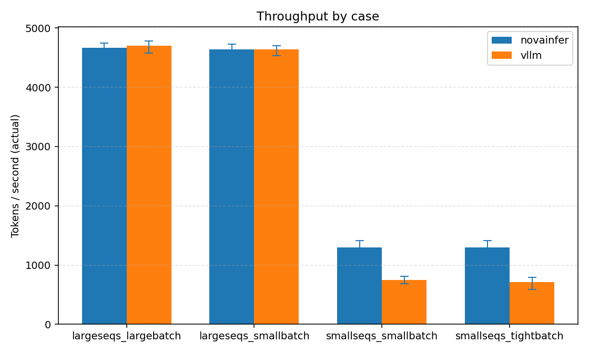
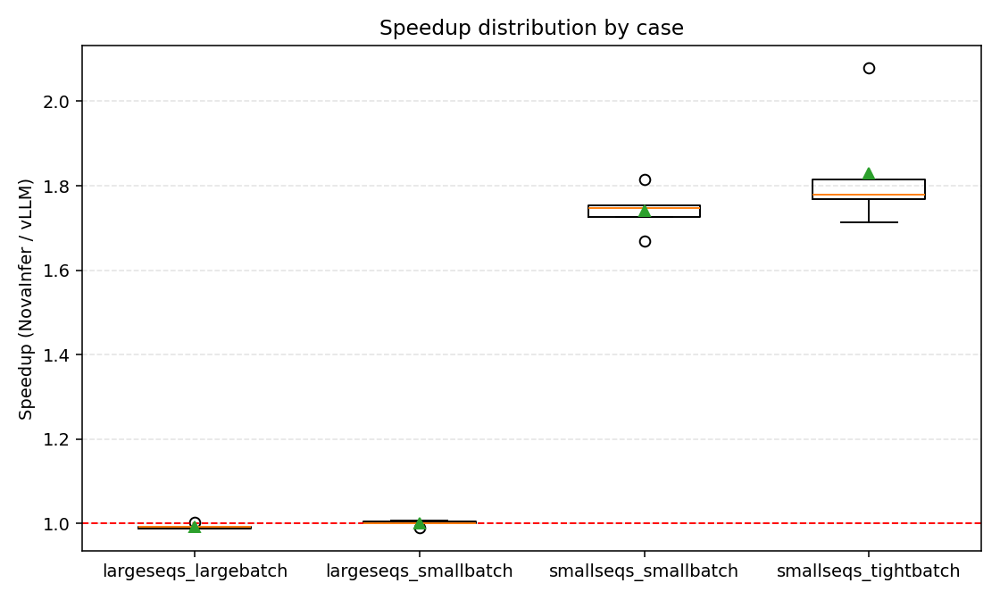
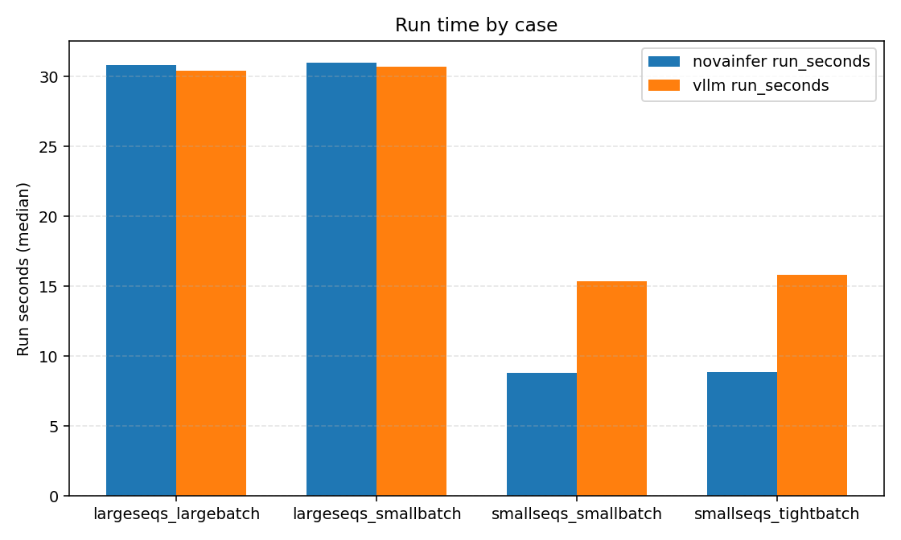

# NovaInfer vs vLLM 性能实验（2026-03-12）

## 目标

构建可复现的实验，解释两类现象：

- 为什么在大负载下 NovaInfer 与 vLLM 基本持平；
- 为什么在小负载下 NovaInfer 明显更快。

本文聚焦吞吐差异，并给出可复现实验脚本、原始数据、图表和结论。

---

## 测试环境（本次实测）

- GPU: `NVIDIA GeForce RTX 3090` (24GB)
- Driver: `580.126.09`
- `nvidia-smi` 报告 CUDA 版本: `13.0`
- 本机 `nvcc`: `cuda_12.8`（`Build cuda_12.8.r12.8`）
- cuDNN 运行时: `9.19.1`（`cudnnGetVersion() = 91901`）

> 说明：`nvidia-smi` 显示的是驱动支持的最高 CUDA 版本；`nvcc` 显示的是本机 toolkit 版本，二者可以不同。

---

## 实验矩阵

本轮使用 4 组工作负载（四组都已实测）：

1. `smallseqs_tightbatch`
- `num_seqs=20`
- 输入长度 `[100,1024]`
- 输出长度 `[100,1024]`
- `max_num_batched_tokens=4096`
- `max_num_seqs=20`
- `kv_cache_memory_utilization=0.7`

2. `smallseqs_smallbatch`
- `num_seqs=20`
- 输入长度 `[100,1024]`
- 输出长度 `[100,1024]`
- `max_num_batched_tokens=8192`
- `max_num_seqs=20`
- `kv_cache_memory_utilization=0.7`

3. `largeseqs_smallbatch`
- `num_seqs=256`
- 输入长度 `[100,1024]`
- 输出长度 `[100,1024]`
- `max_num_batched_tokens=8192`
- `max_num_seqs=256`
- `kv_cache_memory_utilization=0.5`

4. `largeseqs_largebatch`
- `num_seqs=256`
- 输入长度 `[100,1024]`
- 输出长度 `[100,1024]`
- `max_num_batched_tokens=16384`
- `max_num_seqs=256`
- `kv_cache_memory_utilization=0.5`

统一控制项：

- 同一模型路径
- 同一 seed 规则（`seed_base + repeat`）
- 同一 `max_model_len=4096`
- 同一后端模式（`LLAISYS_CUDA_PAGED_ATTN_BACKEND=cudnn`）
- vLLM 侧开启 fair-mode
- NovaInfer 与 vLLM 采样参数对齐（含 `top_k=1`, `top_p=1.0`）

---

## 运行命令

### 1) 跑实验并落盘数据

```bash
python scripts/run_perf_experiments.py \
  --model-path /home/liwenxiao/models/deepseek-ai/DeepSeek-R1-Distill-Qwen-1.5B \
  --repeats 5 \
  --seed-base 1000 \
  --cases smallseqs_tightbatch smallseqs_smallbatch largeseqs_smallbatch largeseqs_largebatch \
  --backend-order novainfer vllm \
  --cudnn-backend cudnn \
  --output-jsonl perf_results_2026-03-12_v2.jsonl \
  --output-log-dir perf_logs_2026-03-12_v2
```

产物：

- `perf_results_2026-03-12_v2.jsonl`：结构化结果
- `perf_logs_2026-03-12_v2/*.log`：每轮原始日志

### 2) 画图

```bash
python scripts/plot_perf_experiments.py \
  --input-jsonl perf_results_2026-03-12_v2.jsonl \
  --out-dir perf_plots_2026-03-12_v2
```

产物：

- `throughput_by_case.png`
- `speedup_by_case.png`（NovaInfer / vLLM）
- `run_seconds_by_case.png`

---

## 实测结果（本机，v2 四组）

数据文件：

- `perf_results_2026-03-12_v2.jsonl`

图表：

- `perf_plots_2026-03-12_v2/throughput_by_case.png`
- `perf_plots_2026-03-12_v2/speedup_by_case.png`
- `perf_plots_2026-03-12_v2/run_seconds_by_case.png`

### 图：各场景吞吐



### 图：加速比分布（NovaInfer / vLLM）



### 图：运行时长（run_seconds）



5 次重复的中位数 `actual_tokens_per_sec`：

| 场景 | NovaInfer | vLLM | 比值（NovaInfer/vLLM） |
|------|----------:|-----:|-----------------------:|
| `smallseqs_tightbatch` | 1293.11 | 740.79 | 1.746x |
| `smallseqs_smallbatch` | 1300.55 | 751.11 | 1.731x |
| `largeseqs_smallbatch` | 4685.31 | 4685.47 | 1.000x |
| `largeseqs_largebatch` | 4727.05 | 4733.52 | 0.999x |

每次重复（rep0~rep4）明细如下（单位：tok/s）：

### `smallseqs_tightbatch` 明细

| repeat | NovaInfer | vLLM | 比值 |
|---:|---:|---:|---:|
| 0 | 1223.82 | 588.84 | 2.078x |
| 1 | 1293.11 | 755.03 | 1.713x |
| 2 | 1234.35 | 680.09 | 1.815x |
| 3 | 1409.81 | 792.71 | 1.778x |
| 4 | 1309.61 | 740.79 | 1.768x |

### `smallseqs_smallbatch` 明细

| repeat | NovaInfer | vLLM | 比值 |
|---:|---:|---:|---:|
| 0 | 1232.84 | 714.31 | 1.726x |
| 1 | 1300.55 | 779.74 | 1.668x |
| 2 | 1245.57 | 686.41 | 1.815x |
| 3 | 1408.83 | 806.19 | 1.748x |
| 4 | 1316.74 | 751.11 | 1.753x |

### `largeseqs_smallbatch` 明细

| repeat | NovaInfer | vLLM | 比值 |
|---:|---:|---:|---:|
| 0 | 4491.15 | 4534.94 | 0.990x |
| 1 | 4578.56 | 4578.14 | 1.000x |
| 2 | 4685.31 | 4685.47 | 1.000x |
| 3 | 4731.87 | 4702.48 | 1.006x |
| 4 | 4721.52 | 4697.38 | 1.005x |

### `largeseqs_largebatch` 明细

| repeat | NovaInfer | vLLM | 比值 |
|---:|---:|---:|---:|
| 0 | 4522.03 | 4574.87 | 0.988x |
| 1 | 4617.03 | 4650.50 | 0.993x |
| 2 | 4727.05 | 4769.41 | 0.991x |
| 3 | 4730.97 | 4784.96 | 0.989x |
| 4 | 4747.94 | 4733.52 | 1.003x |

补充统计（均值与波动）：

- `smallseqs_tightbatch`
  - NovaInfer 均值 1292.14，范围 [1223.82, 1409.81]
  - vLLM 均值 711.49，范围 [588.84, 792.71]
- `smallseqs_smallbatch`
  - NovaInfer 均值 1300.91，范围 [1232.84, 1408.83]
  - vLLM 均值 747.55，范围 [686.41, 806.19]
- `largeseqs_smallbatch`
  - NovaInfer 均值 4641.68，范围 [4491.15, 4731.87]
  - vLLM 均值 4639.68，范围 [4534.94, 4702.48]
- `largeseqs_largebatch`
  - NovaInfer 均值 4668.20，范围 [4522.03, 4747.94]
  - vLLM 均值 4702.65，范围 [4574.87, 4784.96]

---

## 结果解读（按本次实测）

1. 大序列场景基本持平

- 无论 `max_num_batched_tokens=8192` 还是 `16384`，两者中位数几乎一致（1.000x / 0.999x）。
- 说明在高负载区间，主要受 GPU 计算与内存带宽约束，双方都接近硬件上限。

2. 小序列场景 NovaInfer 明显更快

- 两个小场景都在 ~1.73x 到 ~1.75x。
- 且 `4096 -> 8192` 对小场景提升很小（1293 -> 1301），说明小场景瓶颈并不在 batch-token 上限，而在固定开销/调度路径。

3. 对 `max_num_batched_tokens` 的观察

- 在大场景中，`8192 -> 16384` 对 NovaInfer 有小幅收益（4685 -> 4727）。
- 但整体仍与 vLLM 持平，说明该参数在当前配置下对“相对优势”影响有限。

---

## 可能原因（结合本次数据）

1. 大场景：算子主导

- 计算密度高，固定开销被摊薄，性能差距自然收敛。

2. 小场景：固定开销主导

- scheduler、元数据构建、采样与 Python glue 的占比放大。
- 本次结果显示 NovaInfer 在该区间路径更轻。

3. `max_num_batched_tokens` 不是唯一解释

- 小场景中调大该值几乎不改变吞吐，说明“上限值”并非主要矛盾。

---

## 后续建议

1. 增加 prefill/decode 分拆指标

- 当前是整体吞吐，建议单独统计 prefill tok/s、decode tok/s。

2. 增加 `max_num_batched_tokens` sweep（大场景）

- 例如：`4096/8192/12288/16384`，画曲线看拐点。

3. 保留 5~10 次重复并用中位数汇报

- 同时保留 boxplot 观察方差，避免单次结论偏差。
