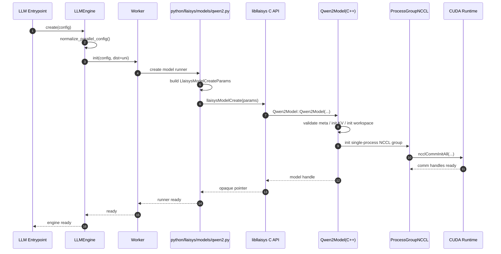
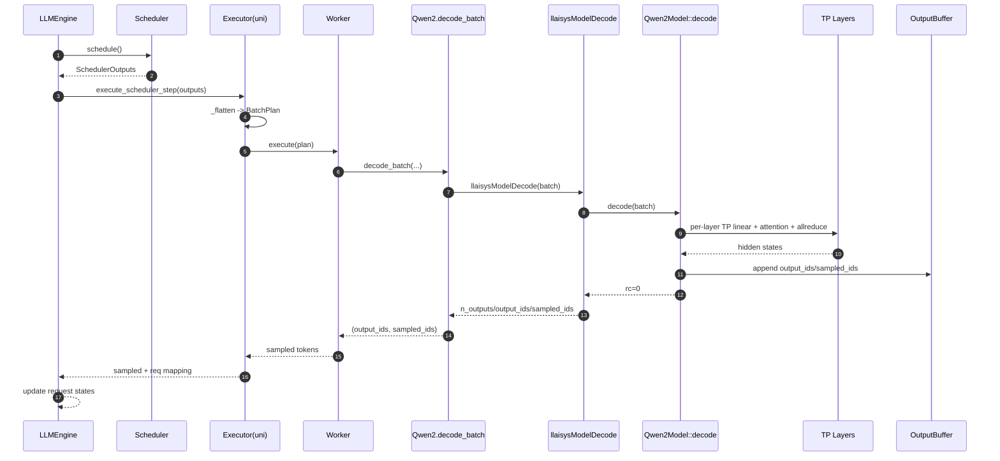
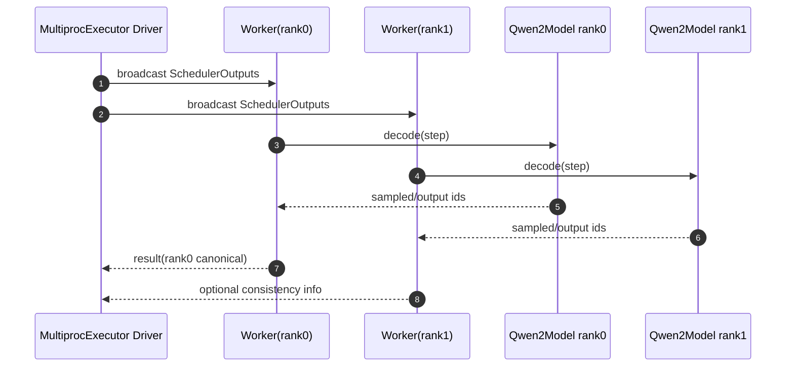

# NovaInfer TP 设计规范（`uni` 交付，vLLM/InfiniTrain 对齐版）

更新时间：2026-02-27  
状态：实现规范（可按本文直接拆任务编码）

---

## 1. 总目标与冻结决策

1. 当前只交付 `uni`（单进程执行后端）。
2. Python 侧参数命名与函数声明尽量对齐 vLLM。
3. C++ 并行层参数命名与函数声明尽量对齐 InfiniTrain。
4. `mp/ray` 只保留兼容字段与扩展接口，不做当前实现承诺。
5. TP 算法层只能有一套实现；后续切 `mp` 不允许复制一套 TP 算法代码。

---

## 2. 源码对齐审计结果（本地仓库）

## 2.1 vLLM（Python）关键定义

来源文件：

1. `/home/liwenxiao/vllm/vllm/config/parallel.py`
2. `/home/liwenxiao/vllm/vllm/v1/executor/abstract.py`
3. `/home/liwenxiao/vllm/vllm/v1/executor/uniproc_executor.py`
4. `/home/liwenxiao/vllm/vllm/v1/worker/worker_base.py`
5. `/home/liwenxiao/vllm/vllm/v1/worker/gpu_worker.py`

关键签名（对齐目标）：

1. `ParallelConfig` 字段（核心）：
- `pipeline_parallel_size`
- `tensor_parallel_size`
- `distributed_executor_backend`
- `master_addr/master_port/node_rank/nnodes`
- `world_size`
- `rank`

2. `Executor.get_class(vllm_config)` 按 `distributed_executor_backend` 选择后端：
- `uni/mp/ray/external_launcher`

3. `Executor` 核心接口：
- `collective_rpc(...)`
- `execute_model(...)`
- `sample_tokens(...)`
- `check_health()`

4. `UniProcExecutor`：
- `_init_executor()`
- `_distributed_args() -> (distributed_init_method, rank, local_rank)`

5. `WorkerBase.__init__(..., local_rank, rank, distributed_init_method, is_driver_worker=False)`

## 2.2 InfiniTrain（C++ 并行）关键定义

来源文件：

1. `/home/liwenxiao/InfiniTrain/infini_train/include/nn/parallel/reduce_op_type.h`
2. `/home/liwenxiao/InfiniTrain/infini_train/include/nn/parallel/work.h`
3. `/home/liwenxiao/InfiniTrain/infini_train/include/nn/parallel/process_group.h`
4. `/home/liwenxiao/InfiniTrain/infini_train/include/nn/parallel/utils.h`
5. `/home/liwenxiao/InfiniTrain/infini_train/include/nn/parallel/tensor_parallel.h`
6. `/home/liwenxiao/InfiniTrain/infini_train/include/nn/parallel/parallel_functional.h`

关键签名（对齐目标）：

1. `enum class ReduceOpType : int8_t { kSum, kProd, kMin, kMax, kAvg }`
2. `class Work`：
- `WaitBlocking` / `WaitNonBlocking`
- `IsCompleted` / `IsSuccess`
- `Synchronize`
- `exception`
- `ready_event` / `done_event`

3. `class ProcessGroup`：
- `GetGroupRank`
- `AllReduce` / `AllGather` / `ReduceScatter`
- `Send` / `Recv`
- `BroadCast` / `ReduceAddCoalesced` / `Scatter` / `Gather`

4. `class ProcessGroupNCCL`
- 构造：`ProcessGroupNCCL(const std::string&, const std::vector<int>&)`
- `InitSingleProcess` / `InitMultiProcess` / `InitStreams`

5. `class ProcessGroupFactory`
- `Instance` / `GetOrCreate` / `GetDefaultProcessGroup`

6. `class ColumnParallelLinear` / `class RowParallelLinear`
- 构造参数 + `Forward(...)` 风格

---

## 3. 对齐契约（必须遵守）

## 3.1 Python 对齐契约（对齐 vLLM）

### 3.1.1 命名契约

NovaInfer 中与并行相关配置字段命名，优先采用 vLLM 同名：

1. `tensor_parallel_size`
2. `pipeline_parallel_size`（当前固定 `1`，但保留字段）
3. `distributed_executor_backend`
4. `master_addr`
5. `master_port`
6. `node_rank`
7. `nnodes`
8. `world_size`
9. `rank`
10. `local_rank`

允许新增但必须说明：

1. `distributed_backend`（当前固定 `nccl`）
2. `tp_group_name`
3. `use_single_process_tp`

### 3.1.2 后端选择契约

必须提供与 vLLM 一致的后端语义：

1. 接受 `distributed_executor_backend in {"uni", "mp", "ray"}`。
2. 当前实现仅支持 `uni`。
3. `mp/ray` 当前必须抛 `NotImplementedError`，不能 silent fallback。

### 3.1.3 函数声明契约

建议在 NovaInfer 保留同名风格接口（参数可用 NovaInfer 类型）：

1. `Executor.get_class(config)`
2. `Executor.collective_rpc(...)`
3. `Executor.execute_model(...)`
4. `Executor.sample_tokens(...)`
5. `Executor.check_health()`

`UniProcExecutor` 保留：

1. `_init_executor()`
2. `_distributed_args() -> (distributed_init_method, rank, local_rank)`

`WorkerBase` 风格构造参数对齐：

1. `local_rank`
2. `rank`
3. `distributed_init_method`
4. `is_driver_worker`

---

## 3.2 C++ 并行对齐契约（对齐 InfiniTrain）

### 3.2.1 命名与类型

1. `ReduceOpType` 枚举值完全同名：`kSum/kProd/kMin/kMax/kAvg`。
2. `Work`/`WorkNccl` 方法名与语义尽量同名。
3. `ProcessGroup`/`ProcessGroupNCCL`/`ProcessGroupFactory` 类名与主方法同名。

### 3.2.2 ProcessGroup 接口（目标声明）

```cpp
class ProcessGroup {
public:
    virtual int GetGroupRank(int global_rank) const;
    virtual std::shared_ptr<Work> AllReduce(const tensor_t& tensor,
                                            function::ReduceOpType reduce_op = function::ReduceOpType::kSum,
                                            bool async_op = false) const = 0;
    virtual std::shared_ptr<Work> AllGather(const tensor_t& output,
                                            const tensor_t& input,
                                            bool async_op = false) const = 0;
    virtual std::shared_ptr<Work> ReduceScatter(const tensor_t& output,
                                                const tensor_t& input,
                                                function::ReduceOpType reduce_op = function::ReduceOpType::kSum,
                                                bool async_op = false) const = 0;
    // 兼容保留 Send/Recv/BroadCast/Scatter/Gather 可分阶段实现
};
```

说明：

1. 名称与 InfiniTrain 保持一致。
2. 参数类型改为 `tensor_t`（这是唯一必要差异）。

### 3.2.3 TP 线性层接口（目标声明）

为了尽量对齐 InfiniTrain，优先采用类 + `Forward` 形式（而不是纯自由函数）：

```cpp
class ColumnParallelLinear {
public:
    ColumnParallelLinear(int64_t in_features,
                         int64_t out_features,
                         bool bias,
                         bool gather_output,
                         bool input_is_parallel,
                         bool skip_bias_add,
                         bool sequence_parallel = false);

    std::vector<tensor_t> Forward(const std::vector<tensor_t>& input_tensors);
};

class RowParallelLinear {
public:
    RowParallelLinear(int64_t in_features,
                      int64_t out_features,
                      bool bias,
                      bool reduce_output,
                      bool input_is_parallel,
                      bool skip_bias_add,
                      bool sequence_parallel = false);

    std::vector<tensor_t> Forward(const std::vector<tensor_t>& input_tensors);
};
```

说明：

1. 名称、构造参数顺序、`Forward` 风格对齐 InfiniTrain。
2. 仅替换底层 Tensor 类型与线性调用实现。

---

## 4. 当前实现边界（`uni`）

## 4.1 当前必做

1. `distributed_executor_backend="uni"` 全链路。
2. `tp_size=1` 与现有行为一致。
3. `tp_size=2`（单进程多卡）可执行。
4. Qwen2 TP 切分 + 两处 allreduce。

## 4.2 当前不做

1. `MultiprocExecutor` 正式实现。
2. 多进程 rendezvous 与 `UniqueId` 分发。
3. `ray` worker 编排。

---

## 5. 配置规范（可直接编码）

## 5.1 Python 配置结构（推荐）

```python
@dataclass
class ParallelConfig:
    pipeline_parallel_size: int = 1
    tensor_parallel_size: int = 1
    distributed_executor_backend: str = "uni"  # uni/mp/ray
    master_addr: str = "127.0.0.1"
    master_port: int = 29501
    node_rank: int = 0
    nnodes: int = 1
    world_size: int = 1
    rank: int = 0
    local_rank: int = 0

    # NovaInfer 补充字段（非 vLLM 原生字段）
    distributed_backend: str = "nccl"
    init_method: str = ""
    tp_group_name: str = "TP0"
    use_single_process_tp: bool = True
    tensor_parallel_device_ids: list[int] | None = None
```

## 5.2 归一化逻辑

```python
def normalize_parallel_config(cfg: ParallelConfig) -> ParallelConfig:
    cfg.tensor_parallel_size = max(1, int(cfg.tensor_parallel_size))
    cfg.world_size = cfg.tensor_parallel_size  # 当前 uni 范围
    cfg.rank = 0
    cfg.local_rank = 0

    if cfg.tensor_parallel_device_ids is None:
        cfg.tensor_parallel_device_ids = list(range(cfg.tensor_parallel_size))

    if cfg.distributed_executor_backend != "uni":
        raise NotImplementedError("only uni backend is implemented in this release")

    if cfg.distributed_backend != "nccl":
        raise NotImplementedError("only nccl backend is supported")

    if len(cfg.tensor_parallel_device_ids) != cfg.tensor_parallel_size:
        raise ValueError("tensor_parallel_device_ids length mismatch")

    if len(set(cfg.tensor_parallel_device_ids)) != len(cfg.tensor_parallel_device_ids):
        raise ValueError("tensor_parallel_device_ids contains duplicates")

    cfg.use_single_process_tp = True
    return cfg
```

---

## 6. C API 结构体规范（ABI）

目标文件：

1. `include/llaisys/models/model.h`
2. `python/llaisys/libllaisys/model.py`

`LlaisysModelCreateParams` 扩展字段顺序（固定）：

1. `model_type`
2. `meta`
3. `device`
4. `device_ids`
5. `ndevice`
6. `kv_cache_layout`
7. `kv_cache_block_size`
8. `max_model_len`
9. `kv_cache_capacity_tokens`
10. `tensor_parallel_size`
11. `pipeline_parallel_size`
12. `world_size`
13. `rank`
14. `local_rank`
15. `distributed_executor_backend`
16. `distributed_backend`
17. `master_addr`
18. `master_port`
19. `node_rank`
20. `nnodes`
21. `init_method`
22. `tp_group_name`
23. `use_single_process_tp`

要求：

1. C 与 ctypes 字段顺序必须一致。
2. 本次即使只用 `uni`，也必须下发并保存这些字段。

---

## 7. Qwen2 TP 算法规范

## 7.1 权重切分

### 7.1.1 基本定义（实现必须使用）

设：

1. `tp_size = tensor_parallel_size`
2. `tp_rank = rank`
3. `hs = hidden_size`
4. `nh = num_attention_heads`
5. `nkvh = num_key_value_heads`
6. `dh = head_dim`
7. `di = intermediate_size`

一期硬约束：

1. `nh % tp_size == 0`
2. `nkvh % tp_size == 0`
3. `di % tp_size == 0`

本地维度：

1. `local_nh = nh / tp_size`
2. `local_nkvh = nkvh / tp_size`
3. `local_di = di / tp_size`

切分函数（按连续块分片）：

1. 对 dim=`d` 的张量切分，`chunk = size[d] / tp_size`。
2. 本 rank 取 `[tp_rank * chunk : (tp_rank + 1) * chunk)`。
3. 一律使用 contiguous shard，禁止交错切分。

### 7.1.2 权重到并行策略映射（Qwen2 inference）

1. `attn_q_w`（全形状 `[nh*dh, hs]`）  
策略：ColumnParallel（按输出维 dim0 分片）。  
本地形状：`[local_nh*dh, hs]`。
2. `attn_k_w`（全形状 `[nkvh*dh, hs]`）  
策略：ColumnParallel（dim0 分片）。  
本地形状：`[local_nkvh*dh, hs]`。
3. `attn_v_w`（全形状 `[nkvh*dh, hs]`）  
策略：ColumnParallel（dim0 分片）。  
本地形状：`[local_nkvh*dh, hs]`。
4. `attn_o_w`（全形状 `[hs, nh*dh]`）  
策略：RowParallel（按输入维 dim1 分片）。  
本地形状：`[hs, local_nh*dh]`。
5. `mlp_gate_w`（全形状 `[di, hs]`）  
策略：ColumnParallel（dim0 分片）。  
本地形状：`[local_di, hs]`。
6. `mlp_up_w`（全形状 `[di, hs]`）  
策略：ColumnParallel（dim0 分片）。  
本地形状：`[local_di, hs]`。
7. `mlp_down_w`（全形状 `[hs, di]`）  
策略：RowParallel（dim1 分片）。  
本地形状：`[hs, local_di]`。
8. `in_embed`（`[voc, hs]`）  
策略：一期复制（Replicated）。
9. `out_norm_w`（`[hs]`）  
策略：一期复制（Replicated）。
10. `out_embed`（`[voc, hs]`）  
策略：一期复制（Replicated，不做 vocab parallel）。
11. 偏置（若存在）：  
`attn_q_b/attn_k_b/attn_v_b` 按对应输出维随 ColumnParallel 同步切分；其余按算子需求复制。

### 7.1.2.1 融合 `QKVLinear` 分片（可选优化，不是一期默认）

InfiniTrain TP 抽象本身不要求 `QKV` 融合；其基线是通用 `ColumnParallelLinear/RowParallelLinear`。
因此 NovaInfer 一期默认采用与 InfiniTrain 一致的“非融合实现”（q/k/v 三个线性）。
当后续为了性能引入融合 `QKVLinear` 时，必须满足以下等价分片规则。

全局定义：

1. `q_size_global = nh * dh`
2. `kv_size_global = nkvh * dh`
3. `qkv_out_global = q_size_global + kv_size_global + kv_size_global`
4. `q_size_local = local_nh * dh`
5. `kv_size_local = local_nkvh * dh`
6. `qkv_out_local = q_size_local + kv_size_local + kv_size_local`

融合权重形状：

1. 全局：`qkv_w_global.shape = [qkv_out_global, hs]`
2. 本地：`qkv_w_local.shape = [qkv_out_local, hs]`

融合偏置形状（若开启）：

1. 全局：`qkv_b_global.shape = [qkv_out_global]`
2. 本地：`qkv_b_local.shape = [qkv_out_local]`

加载规则（保持与 ColumnParallel 语义严格等价）：

1. 不做一次性整块切分后再拆分（避免 q/k/v 边界错位）。
2. 必须按 `q/k/v` 三段分别切分后拼接：
`q_local = shard_dim(q_global, dim=0)`  
`k_local = shard_dim(k_global, dim=0)`  
`v_local = shard_dim(v_global, dim=0)`  
`qkv_local = concat([q_local, k_local, v_local], dim=0)`。
3. 偏置同理：`q_b/k_b/v_b` 分段切分后拼接为 `qkv_b_local`。

前向规则：

1. `qkv = linear(x, qkv_w_local, qkv_b_local)`，输出 `[T, qkv_out_local]`。
2. 按本地尺寸切分：  
`q, k, v = split(qkv, [q_size_local, kv_size_local, kv_size_local], dim=-1)`。
3. reshape：  
`q -> [T, local_nh, dh]`；`k/v -> [T, local_nkvh, dh]`。
4. 后续 KV 写入与 attention 全部基于本地 `local_nkvh`。

### 7.1.3 加载阶段实现规则（直接可编码）

`ColumnParallel` 权重加载：

1. 输入全量权重 `W_full`。
2. 按 dim0 做均匀块切分。
3. 取本 rank 子块拷贝到本地参数。
4. 对融合 `QKVLinear`（若启用），按 7.1.2.1 的 `q/k/v` 分段切分并拼接。

`RowParallel` 权重加载：

1. 输入全量权重 `W_full`。
2. 按 dim1 做均匀块切分。
3. 取本 rank 子块拷贝到本地参数。

`Replicated` 权重加载：

1. 全 rank 加载同一份参数，不切分。

加载校验（必须）：

1. 分片前验证目标维可整除 `tp_size`。
2. 每个分片后验证本地形状严格匹配预期。
3. 报错信息必须包含：`weight_name/global_shape/local_shape/tp_size/tp_rank`。

### 7.1.4 前向阶段张量形状与通信规则

Attention 子层：

1. `q_proj`: 输出 `[T, local_nh*dh]`。
2. `k_proj/v_proj`: 输出 `[T, local_nkvh*dh]`。
3. 局部 attention 在本 rank 上运行，输入 KV 也是本地 `local_nkvh`。
4. `attn_o_w` 为 RowParallel，得到局部贡献后执行一次 `AllReduce(sum)`，恢复 `[T, hs]`。

MLP 子层：

1. `gate/up` 为 ColumnParallel，输出 `[T, local_di]`。
2. `down` 为 RowParallel，得到局部贡献后执行一次 `AllReduce(sum)`，恢复 `[T, hs]`。

约束：

1. 每层仅两次 collective：`attn_o` 后一次，`mlp_down` 后一次。
2. 一期不引入额外 `AllGather/ReduceScatter`。

### 7.1.5 与当前代码衔接的最小改动点

1. `meta_` 保留全局维度；新增运行时 `tp_size_`、`tp_rank_`、`local_nh_`、`local_nkvh_`、`local_di_`。
2. `check_meta_invariants_()` 增加 `nh/nkvh/di` 对 `tp_size_` 的整除校验。
3. 权重注册接口按全名不变，内部保存本 rank 分片 tensor。
4. `run_layers_and_collect_()` 中 Q/K/V reshape 改为 local 维度。
5. KV cache 初始化 head 维切到 `local_nkvh_`（与 7.4 保持一致）。

### 7.1.6 关键实现伪代码（可直接翻译到 C++）

初始化并行维度：

```cpp
tp_size_ = std::max<int>(1, create_params.tensor_parallel_size);
tp_rank_ = create_params.rank;
CHECK_ARGUMENT(tp_rank_ >= 0 && tp_rank_ < tp_size_, "invalid tp rank");

local_nh_ = meta_.nh / tp_size_;
local_nkvh_ = meta_.nkvh / tp_size_;
local_di_ = meta_.di / tp_size_;
```

权重切分辅助函数：

```cpp
tensor_t shard_dim(const tensor_t& full, int dim, int tp_rank, int tp_size) {
    const size_t dim_size = full->shape()[dim];
    CHECK_ARGUMENT(dim_size % tp_size == 0, "tp shard dim not divisible");
    const size_t chunk = dim_size / tp_size;
    return full->slice(dim, tp_rank * chunk, (tp_rank + 1) * chunk)->contiguous();
}
```

权重装载（示例）：

```cpp
// ColumnParallel
attn_q_w_local[layer] = shard_dim(attn_q_w_full[layer], /*dim=*/0, tp_rank_, tp_size_);
attn_k_w_local[layer] = shard_dim(attn_k_w_full[layer], 0, tp_rank_, tp_size_);
attn_v_w_local[layer] = shard_dim(attn_v_w_full[layer], 0, tp_rank_, tp_size_);
mlp_gate_w_local[layer] = shard_dim(mlp_gate_w_full[layer], 0, tp_rank_, tp_size_);
mlp_up_w_local[layer] = shard_dim(mlp_up_w_full[layer], 0, tp_rank_, tp_size_);

// RowParallel
attn_o_w_local[layer] = shard_dim(attn_o_w_full[layer], /*dim=*/1, tp_rank_, tp_size_);
mlp_down_w_local[layer] = shard_dim(mlp_down_w_full[layer], 1, tp_rank_, tp_size_);

// Fused QKV (optional)
q_local = shard_dim(attn_q_w_full[layer], 0, tp_rank_, tp_size_);
k_local = shard_dim(attn_k_w_full[layer], 0, tp_rank_, tp_size_);
v_local = shard_dim(attn_v_w_full[layer], 0, tp_rank_, tp_size_);
qkv_w_local[layer] = concat({q_local, k_local, v_local}, /*dim=*/0);
```

前向（示例）：

```cpp
q = linear(x, attn_q_w_local);          // [T, local_nh*dh]
k = linear(x, attn_k_w_local);          // [T, local_nkvh*dh]
v = linear(x, attn_v_w_local);          // [T, local_nkvh*dh]
store_local_kv(k, v);                   // 写本 rank KV cache
o_local = attention_local(q, local_kv); // 本地注意力
y_local = linear(o_local, attn_o_w_local);
y = allreduce_sum(y_local);             // 恢复 [T, hs]
```

融合 QKV 前向（可选优化示例）：

```cpp
qkv = linear(x, qkv_w_local, qkv_b_local); // [T, q_size_local + 2*kv_size_local]
q, k, v = split(qkv, {q_size_local, kv_size_local, kv_size_local}, -1);
q = q.view({T, local_nh_, dh});
k = k.view({T, local_nkvh_, dh});
v = v.view({T, local_nkvh_, dh});
```

### 7.1.7 代码落地顺序（按函数拆分）

1. `Qwen2Model::Qwen2Model(...)`  
读取并保存 `tp_size_/tp_rank_/local_rank_`，基于 `local_rank_` 选择 `device_id_`。
2. `Qwen2Model::check_meta_invariants_()`  
新增 `nh/nkvh/di` 整除校验。
3. `Qwen2Model::init_kv_cache_()`  
`init_storage(..., local_nkvh_, ...)`。
4. 权重注册与校验路径（`set_weights`/`check_weights_`）  
将全量输入权重切分为本地 shard，校验本地形状。
5. `Qwen2Model::run_layers_and_collect_()`  
所有 Q/K/V 与 MLP 的 view/linear 形状切到 local 维；`attn_o/mlp_down` 后接 `AllReduce(sum)`。
6. `ops::parallel` 封装  
提供 `allreduce_sum(tensor_t)`，`tp_size==1` 走 no-op。
7. 回归  
先打通 `tp_size=1` 等价，再验证 `tp_size=2/4`。

### 7.1.8 与 InfiniTrain 对齐审计（分片策略重点）

本节结论用于回答“是否完全对齐”。

1. `ColumnParallelLinear` 分片维度  
状态：`已对齐`。  
说明：均为按输出维分片（`weight[out/tp, in]`）。
2. `RowParallelLinear` 分片维度  
状态：`已对齐`。  
说明：均为按输入维分片（`weight[out, in/tp]`）。
3. QKV/MLP 权重分片公式  
状态：`已对齐`。  
说明：`q/k/v/gate/up` 走 Column；`o/down` 走 Row；整除约束一致。
4. KV cache 与 TP head 对齐  
状态：`已对齐（一期目标）`。  
说明：要求 `nkvh % tp_size == 0`，`local_nkvh = nkvh / tp_size`。
5. `gather_output/input_is_parallel/skip_bias_add/sequence_parallel` 行为面  
状态：`未对齐（一期不实现）`。  
说明：InfiniTrain 支持这些开关；NovaInfer 一期固定最小语义。
6. `VocabParallelEmbedding/ParallelLMHead`  
状态：`未对齐（一期不实现）`。  
说明：一期采用 replicated `in_embed/out_embed`，不做 vocab 并行。

本项目一期判定规则：

1. 若只看“推理主链路所需的 dense 权重分片策略”，视为对齐。
2. 若看 “InfiniTrain TP 全能力面”，不视为完全对齐。

### 7.1.9 InfiniTrain 的 Vocab 并行实现拆解（分片点/计算点/通信点）

本节描述 InfiniTrain 现有实现行为，用于解释为何本项目一期暂不接入。

实现来源：

1. `infini_train/src/nn/parallel/tensor_parallel.cc`
2. `infini_train/include/nn/parallel/tensor_parallel.h`

#### A. VocabParallelEmbedding

分片点：

1. 词表维分片：`num_embeddings / tp_size`。
2. 每个 rank 持有本地 embedding 权重：`[vocab_size_per_partition, embedding_dim]`。
3. 每个 rank 维护本地词表区间：`[vocab_start_index, vocab_end_index)`。

计算点：

1. 输入 token 先做区间掩码：不在本 rank 区间的 token 置为 0 索引（masked_input）。
2. 本地执行 embedding lookup，得到 `local_output`。
3. 对无效 token 行做置零（保证仅本 rank 负责本区间词条贡献）。

通信点：

1. `ReduceFromTPRegion(local_output)`：把各 rank 的局部 embedding 输出求和为全局输出。
2. 若启用 sequence parallel，则走 `ReduceScatterToSPRegion` 分支。

#### B. Vocab Parallel Cross Entropy（InfiniTrain 训练路径）

分片点：

1. logits 最后一维按 vocab 切分：每 rank 仅持有 `vocab_size_local` 列。
2. target 对应词若不在本 rank 词表区间，走 mask 路径。

计算点：

1. 局部 logits 先做 padding 区间掩码（超出原始 vocab 的 padded 列设为 `-inf`）。
2. 计算局部 `max/exp/sum_exp_local`、局部 `pred_local`。
3. 使用本地 softmax 分片 + 全局归一化组合得到最终 loss。

通信点：

1. 全局最大值：`AllReduce(kMax)`。
2. 全局分母：`ReduceFromTPRegion(sum_exp_local)`。
3. 全局目标 logit：`ReduceFromTPRegion(pred_local)`。
4. label smoothing 分支的有效项和：`ReduceFromTPRegion(sum_shifted_valid_local)`。

#### C. 对 NovaInfer 一期的影响

1. 一期若实现 vocab parallel，必须同时改 embedding 前向、lm_head/logits、采样入口或 loss 路径。
2. 通信与 mask 逻辑将从“dense 主干 TP”扩展到“输入/输出词表路径”，改动面明显扩大。
3. 因此一期保持 `in_embed/out_embed` replicated，先聚焦 dense TP（attention/mlp）主链路。

### 7.1.10 前向全链路拆解（含真实例子）

本节给出“分片点/计算点/通信点”的端到端清单，并用一组可运行参数做形状示例。

示例参数（Qwen2 风格）：

1. `tp_size=2`
2. `hs=2048`
3. `nh=16`, `dh=128`，因此 `nh*dh=2048`
4. `nkvh=8`
5. `di=5632`
6. 本 step token 数 `T=6`

得到本地维度：

1. `local_nh=8`
2. `local_nkvh=4`
3. `local_di=2816`

#### A. InfiniTrain 完整 TP 语义（含 vocab 并行）

1. 输入 embedding（VocabParallelEmbedding）
- 分片点：词表维分片，每 rank 持有 `[vocab/tp, hs]`。
- 计算点：本 rank 仅 lookup 自己词表区间的 token，其余 token 行置零。
- 通信点：`ReduceFromTPRegion(local_embed)` 聚合得到 `[T, hs]`。

2. Attention 的 Q/K/V 投影
- 分片点：`q/k/v` 走 ColumnParallel。
- 计算点：本 rank 计算  
`q_local: [T, local_nh*dh] = [6, 1024]`  
`k_local: [T, local_nkvh*dh] = [6, 512]`  
`v_local: [T, local_nkvh*dh] = [6, 512]`。
- 通信点：无。

3. KV cache 写入与 attention
- 分片点：KV cache 的 head 维按 `local_nkvh` 本地存储。
- 计算点：本 rank 只写/读本地 KV；attention 只在本地 KV 上计算。
- 通信点：无。

4. `attn_o`（RowParallel）
- 分片点：`attn_o_w` 按输入维分片，本 rank 权重 `[hs, local_nh*dh] = [2048, 1024]`。
- 计算点：本 rank 得到 `y_local: [T, hs] = [6, 2048]`（局部贡献）。
- 通信点：`AllReduce(sum)` 得全局 `y: [6, 2048]`。

5. MLP（`gate/up/down`）
- 分片点：`gate/up` Column，`down` Row。
- 计算点：  
`gate/up` 输出 `[T, local_di] = [6, 2816]`，  
`down` 后得到本地贡献 `[6, 2048]`。
- 通信点：`down` 后 `AllReduce(sum)` 得全局 hidden `[6, 2048]`。

6. 输出端（训练语义）
- 分片点：logits vocab 维分片（每 rank 本地 vocab shard）。
- 计算点：局部 softmax 统计与目标项计算。
- 通信点：`AllReduce(max)`、`Reduce(sum_exp_local)`、`Reduce(pred_local)` 等。

#### B. NovaInfer 一期语义（当前目标）

1. Dense 主链路与上面一致：`q/k/v/gate/up/down/o` 的分片策略、形状与通信点一致。
2. KV cache 行为一致：本地 `local_nkvh` 存取，不做跨 rank KV gather。
3. 差异仅在 vocab 路径：
- 分片点：`in_embed/out_embed` 不分片，replicated。
- 计算点：不做 vocab 区间 mask 逻辑。
- 通信点：不引入 vocab 路径上的额外 reduce/allreduce。

#### C. 例子中的通信计数（每层）

按上述示例，一层 Transformer 的 TP 通信固定为：

1. `attn_o` 后 1 次 `AllReduce(sum)`。
2. `mlp_down` 后 1 次 `AllReduce(sum)`。
3. 合计每层 2 次（一期不增加其它 collective）。

### 7.1.11 前向步骤函数名对照表（NovaInfer vs InfiniTrain）

下表用于代码追踪。若 NovaInfer 一栏标注“目标”，表示该点在一期需要新增/改造。

| 步骤 | NovaInfer（当前/目标） | InfiniTrain（现有） | 说明 |
|---|---|---|---|
| 输入 embedding | `Qwen2Model::decode` -> `ops::embedding`（经模型前向链） | `VocabParallelEmbedding::Forward` + `autograd::Embedding` | InfiniTrain 为 vocab 并行；NovaInfer 一期为 replicated。 |
| Attention 预归一化 | `Qwen2Model::run_layers_and_collect_` -> `ops::rms_norm` | 模型层内 LN + `ColumnParallelLinear::Forward` 输入 | 计算点一致，TP 仅影响后续线性。 |
| Q 投影 | `Qwen2Model::run_layers_and_collect_` -> `ops::linear`（`attn_q_w`） | `ColumnParallelLinear::Forward` + `autograd::Linear` | 分片语义：Column。 |
| K 投影 | `Qwen2Model::run_layers_and_collect_` -> `ops::linear`（`attn_k_w`） | `ColumnParallelLinear::Forward` + `autograd::Linear` | 分片语义：Column。 |
| V 投影 | `Qwen2Model::run_layers_and_collect_` -> `ops::linear`（`attn_v_w`） | `ColumnParallelLinear::Forward` + `autograd::Linear` | 分片语义：Column。 |
| RoPE | `Qwen2Model::run_layers_and_collect_` -> `ops::rope` | 模型 attention 前向中 RoPE 路径 | 本地计算，不通信。 |
| KV 写入 | `ops::cuda::scatter_kv_cache_by_slots_device_indices` / CPU `copy_token_into_cache_` | attention 前向内本地 KV 写入 | 均为本地 KV 存取。 |
| Attention 核心 | `ops::cuda::dispatch_attention_with_backend` / `ops::self_attention_paged` / `ops::self_attention_masked` | 模型 attention 前向（局部 heads） | 本地计算，不做 KV 跨 rank 聚合。 |
| O 投影（Row） | `Qwen2Model::run_layers_and_collect_` -> `ops::linear`（`attn_o_w`） | `RowParallelLinear::Forward` + `autograd::Linear` | 分片语义：Row。 |
| O 投影后通信 | 当前：无 TP collective；目标：`ops::parallel::allreduce_sum`（新增） | `ReduceFromTPRegionFunc` -> `ProcessGroup::AllReduce(kSum)` | 一期必须补齐该通信点。 |
| MLP gate/up（Column） | `Qwen2Model::run_layers_and_collect_` -> `ops::linear`（`mlp_gate_w/mlp_up_w`） | `ColumnParallelLinear::Forward` + `autograd::Linear` | 分片语义：Column。 |
| Swiglu | `Qwen2Model::run_layers_and_collect_` -> `ops::swiglu` | 模型 MLP 激活路径 | 本地计算。 |
| MLP down（Row） | `Qwen2Model::run_layers_and_collect_` -> `ops::linear`（`mlp_down_w`） | `RowParallelLinear::Forward` + `autograd::Linear` | 分片语义：Row。 |
| MLP down 后通信 | 当前：无 TP collective；目标：`ops::parallel::allreduce_sum`（新增） | `ReduceFromTPRegionFunc` -> `ProcessGroup::AllReduce(kSum)` | 一期必须补齐该通信点。 |
| 最终 norm | `Qwen2Model::run_layers_and_collect_` -> `ops::rms_norm` | 模型末端 norm | 本地计算。 |
| 输出 logits | `ops::linear_indexed` + `OutputBuffer::append_*` | 训练侧对应 `VocabParallelCrossEntropy::Forward`（非推理头） | InfiniTrain 文中是训练并行 CE 路径。 |
| vocab 路径通信 | 一期不实现（replicated `out_embed`） | `AllReduce(kMax)` + `ReduceFromTPRegion(sum_exp/pred)` | 属于 vocab 并行能力面。 |

## 7.2 每层通信点

1. `attn_o` 后 `AllReduce(sum)`
2. `mlp_down` 后 `AllReduce(sum)`

说明（避免歧义）：

1. 上述两点是“一期主链路（dense TP inference）”的必选通信点，已覆盖当前实现目标。
2. 本节不包含可选并行分支通信。
3. `AllGather` 会在以下场景出现：
- `ColumnParallel` 开启 `gather_output=true`。
- 启用 `sequence_parallel`（通常与 `ReduceScatter` 配对）。
- vocab 并行路径需要拼接全量 logits（一期不实现）。
4. 一期显式约束：不启用上述可选分支，因此每层通信固定为 2 次 `AllReduce(sum)`。

## 7.3 不变语义

1. `tp_size=1` collective = no-op。
2. 不允许新增额外 collective 次数。
3. prefill/decode 主图保持同一执行主干。

## 7.4 TP 下 KV Cache 规范（新增，必须实现）

本节定义 `tensor_parallel_size > 1` 时 KV cache 的唯一行为规范。

### 7.4.1 当前差距（必须先对齐）

1. 当前 `Qwen2Model` 只使用 `device_ids[0]`，未按 `rank` 选择设备。
2. 当前 KV 按全量 `meta_.nkvh` 分配，未按 TP rank 切分。
3. 当前 K/V 写入与 attention 读取均默认全量 `nkvh` 视角。

### 7.4.2 目标语义

设：

1. `tp_size = tensor_parallel_size`
2. `tp_rank = rank in [0, tp_size)`
3. `global_nkvh = meta_.nkvh`

则：

1. 一期只支持按 KV head 均匀分片。  
2. 必须满足 `global_nkvh % tp_size == 0`。  
3. `local_nkvh = global_nkvh / tp_size`。  
4. 不实现 `global_nkvh < tp_size` 的 KV 复制路径。

### 7.4.3 C API 与模型入参（必须新增/使用）

以下字段必须下发到 C++ 并实际生效：

1. `tensor_parallel_size`
2. `world_size`
3. `rank`
4. `local_rank`
5. `device_ids`

映射规则：

1. `device_id = device_ids[local_rank]`（`uni` 首期可约束 `local_rank=0`，但字段仍必须生效）。
2. `tp_size = tensor_parallel_size`。
3. `tp_rank = rank`（`uni` 首期固定 `0`，接口不固定）。

### 7.4.4 KV 分配与读写规则

1. `kv_cache_->init_storage(...)` 的 head 维必须改为 `local_nkvh`，不能继续使用全量 `meta_.nkvh`。
2. Q/K/V 投影后，K/V 写 cache 前需先得到本 rank 的 local K/V 视图（仅分片策略）。
3. `scatter_kv_cache_by_slots_*` 写入的 `k_src/v_src` 必须是 `[ntoken, local_nkvh, dh]`。
4. attention kernel 输入的 `k_cache/v_cache.shape()[1]` 必须等于 `local_nkvh`。
5. paged metadata（`q_seq_rows/q_pos/block_tables/seq_lens`）保持各 rank 同构，不参与 TP 分片。

### 7.4.5 与 nano-vLLM 一期语义对齐点

1. `num_kv_heads` 必须可被 `tp_size` 整除。
2. KV heads 仅分片，不做复制。
3. attention 计算使用 rank-local KV 视角，层间通信仍只发生在 TP 线性层既定通信点。

### 7.4.6 约束与错误处理

启动时必须校验：

1. `tp_size >= 1`
2. `0 <= tp_rank < tp_size`
3. `global_nkvh % tp_size == 0`

失败处理：

1. 参数不满足时直接 `CHECK_ARGUMENT` fail-fast。
2. 错误日志必须打印：`tp_size/tp_rank/global_nkvh/local_nkvh/device_id`。

### 7.4.7 验收用例（新增）

1. `global_nkvh=8, tp_size=2`  
预期：`local_nkvh=4`，每 rank KV 显存约为单卡一半，token 结果与 TP=1 一致。
2. `global_nkvh=8, tp_size=4`  
预期：`local_nkvh=2`，同上。
3. 非法场景：`global_nkvh=2, tp_size=4`  
预期：初始化直接报错并退出（一期不支持复制路径）。
4. 非法场景：`global_nkvh=3, tp_size=2`  
预期：初始化直接报错并退出。

---

## 8. 运行时时序（`uni`）

## 8.1 引擎初始化时序



## 8.2 单步执行时序（prefill/decode 共用）



## 8.3 prefill 与 decode 分支点

1. 两者共享同一 `Qwen2Model::decode` 主图，不拆两套执行链路。
2. 差异只在 `BatchPlan` 内容：
- `prefill`：一个请求可携带多 token，`logits_mask` 只标记需采样位置。
- `decode`：通常每请求 1 token，`logits_mask` 行数与请求数一致。
3. 输出映射统一由 `output_ids -> request_id` 完成，保持请求级语义稳定。

## 8.4 `mp` 预留时序（当前不实现，仅兼容）



## 8.5 Executor 与 Worker 分层（必须统一理解）

### 8.5.1 职责边界

`Executor`（控制面）负责：

1. 接收 `SchedulerOutputs` 并生成可执行批计划（`BatchPlan`）。
2. 选择执行后端（`uni/mp/ray`），并做跨 worker 的编排。
3. 广播/收集 step 输入输出（`mp` 时）。
4. 结果规范化（canonical result）后回传给 `LLMEngine`。
5. 健康检查、超时控制、异常聚合与重试策略入口。

`Worker`（执行面）负责：

1. 绑定设备上下文（`local_rank -> cuda device`）。
2. 持有模型实例与 KV cache 资源。
3. 执行模型推理（`prefill/decode`）并返回采样结果。
4. 在 TP 场景下持有本 rank 的 `ProcessGroup`/通信上下文。
5. 对输入做最小必要校验，不承担全局调度策略。

边界约束：

1. `Executor` 不进入算子细节，不直接操作 TP kernel。
2. `Worker` 不做跨请求公平调度，不持有全局请求队列策略。
3. `TP` 算法只存在于 C++ 模型/算子路径，`uni/mp` 不复制算法代码。

### 8.5.2 `uni` 与 `mp` 的本质差异

`uni`：

1. 一个 Python 进程内完成控制面与执行面调用。
2. `Executor -> Worker` 是函数调用，开销低、实现简单。
3. 适合首期落地与 TP 算法联调。

`mp`（后续）：

1. 一个 driver 进程 + 多个 worker 进程（通常 1 进程/1 GPU）。
2. `Executor -> Worker` 通过 IPC/RPC，存在序列化与同步成本。
3. 适合隔离 GPU 上下文、对齐 vLLM 的部署模型。

### 8.5.3 真实 `mp` 示例（4 卡 TP）

示例设定：

1. `tensor_parallel_size=4`
2. `distributed_executor_backend="mp"`
3. 进程拓扑：`driver + worker(rank0..3)`

单步流程：

1. `driver/executor` 从 `scheduler` 获得 `SchedulerOutputs`。
2. `executor` 生成统一 `BatchPlan`，广播给 `rank0..3` worker。
3. 每个 worker 在本地 GPU 执行同一模型图，但权重为本 rank 分片。
4. C++ TP 层在每层固定通信点执行 `AllReduce/AllGather`（同一套接口）。
5. `rank0` 产出 canonical sampled tokens，返回 driver。
6. driver 回写请求状态，进入下一 step。

设计意义：

1. Python 控制面变化（`uni -> mp`）不改变 C++ TP 算法接口。
2. 只替换执行编排层，不替换模型与算子实现层。

### 8.5.4 Python 侧最小接口约束（实现级）

`Executor` 抽象要求：

1. `execute_model(self, scheduler_outputs) -> ExecutorOutputs`
2. `collective_rpc(self, method: str, *args, **kwargs)`
3. `check_health(self) -> None`
4. `shutdown(self) -> None`

`Worker` 抽象要求：

1. `init_device(self) -> None`
2. `load_model(self) -> None`
3. `execute_model(self, batch_plan) -> WorkerOutputs`
4. `profile(self) -> dict`
5. `check_health(self) -> None`

一致性要求：

1. `UniProcExecutor` 与未来 `MultiprocExecutor` 共享同一 `Executor` 抽象。
2. `Worker` 请求/响应结构体字段保持稳定，避免 `mp` 时再改模型接口。
3. 错误语义统一：worker 异常必须带 `rank/local_rank` 元信息回传。

### 8.5.5 错误处理与可观测性约束

必须落地：

1. 每 step 记录 `step_id, batch_size, num_prefill_tokens, num_decode_tokens`。
2. 每次 collective 失败日志必须包含 `op, group, rank, cuda_device`。
3. `Executor` 超时错误与 `Worker` 执行错误分开统计。
4. `rank0` 与非 `rank0` 输出不一致时，直接 fail-fast（调试期开启）。

---

## 9. 文件级改造清单（当前交付）

## 9.1 新增

1. `src/parallel/reduce_op_type.hpp`
2. `src/parallel/work.hpp`
3. `src/parallel/work.cpp`
4. `src/parallel/process_group.hpp`
5. `src/parallel/process_group.cpp`
6. `src/parallel/utils.hpp`
7. `src/parallel/utils.cpp`
8. `src/parallel/tensor_parallel.hpp`
9. `src/parallel/tensor_parallel.cpp`

## 9.2 修改

1. `xmake.lua`（`nv-nccl` 开关）
2. `xmake/nvidia.lua`（链接 `nccl`）
3. `include/llaisys/models/model.h`（CreateParams 扩展）
4. `python/llaisys/libllaisys/model.py`（ctypes 对齐）
5. `python/llaisys/engine/config.py`（ParallelConfig + normalize）
6. `python/llaisys/engine/llm_engine.py`（后端选择，当前仅 uni）
7. `python/llaisys/engine/worker.py`（透传并行配置）
8. `python/llaisys/models/qwen2.py`（权重分片上传）
9. `src/llaisys/qwen2/qwen2_model.hpp/.cpp`（TP 执行接入）

## 9.3 vLLM 对齐版文件级改动清单（到函数名级，可逐项实现）

本节目标：

1. Python 控制面接口风格对齐 vLLM（executor/worker 分层与参数命名）。
2. C++ TP 算法接口保持一套，不因 `uni/mp` 重复实现。
3. 当前仅实现 `uni`，但改动后可无缝扩展到 `mp`。

对应参考（对齐基准）：

1. vLLM：`/home/liwenxiao/vllm/vllm/v1/executor/*.py`、`/home/liwenxiao/vllm/vllm/v1/worker/*.py`
2. InfiniTrain：`/home/liwenxiao/InfiniTrain/infini_train/src/nn/parallel/*.cc`

### 9.3.1 P0：并行配置与后端分发（Python）

1. 文件：`python/llaisys/engine/config.py`
- 函数：`normalize_parallel_config(...)`（新增或改造）
- 必做：
1. 归一化 `tensor_parallel_size/world_size/rank/local_rank`。
2. 校验 `distributed_executor_backend in {"uni","mp","ray"}`。
3. 当前仅允许 `uni`，其余抛 `NotImplementedError`。
4. 校验 `tensor_parallel_device_ids` 长度与唯一性。
- 完成判定：
1. 非法配置在入口失败，报错包含字段名和值。

2. 文件：`python/llaisys/engine/llm_engine.py`
- 函数：`LLMEngine._init_executor(...)`（新增或改造）
- 必做：
1. 按 `distributed_executor_backend` 选择 executor 类。
2. 当前映射：`"uni" -> UniProcExecutor(或当前 Executor)`；`"mp"/"ray"` 抛 `NotImplementedError`。
- 完成判定：
1. 初始化日志打印 backend/tp_size/world_size。

3. 文件：`python/llaisys/engine/executor.py`
- 函数：`Executor.execute_scheduler_step(...)`
- 函数：`Executor._flatten(...)`
- 必做：
1. 保持只做控制面 flatten/结果回填，不进入 TP 算法细节。
2. `BatchPlan` 中保留 rank 无关的 canonical 输入（供未来 mp 广播复用）。
- 完成判定：
1. 同一 `SchedulerOutputs` 在 `tp=1/2` 生成一致语义的 `BatchPlan`（仅设备相关字段不同）。

4. 文件：`python/llaisys/engine/worker.py`
- 函数：`Worker._create_model_runner(...)`
- 函数：`Worker.execute(...)`
- 必做：
1. `Worker` 构造时持有 `rank/local_rank/world_size/distributed_init_method`。
2. `_create_model_runner` 将并行参数完整透传到模型构造。
3. `execute` 只调用 model runner，不做调度决策。
- 完成判定：
1. 启动日志包含 `rank/local_rank/device/tp_size`。

### 9.3.2 P0：C API 与 ctypes 对齐（Python <-> C++）

1. 文件：`include/llaisys/models/model.h`
- 结构：`LlaisysModelCreateParams`
- 必做：
1. 字段顺序严格按第 6 节定义。
2. 新增字段保持 ABI 兼容策略（仅追加，不重排旧字段语义）。
- 完成判定：
1. `sizeof` 与 Python 侧一致。

2. 文件：`python/llaisys/libllaisys/model.py`
- 结构：`class LlaisysModelCreateParams(Structure)`
- 必做：
1. `_fields_` 顺序与 C 完全一致。
2. `lib.llaisysModelCreate.argtypes` 保持 `POINTER(LlaisysModelCreateParams)`。
- 完成判定：
1. 构造参数 round-trip（Python->C）字段值不串位。

### 9.3.3 P0：权重加载机制（对齐 vLLM worker/model-runner 风格）

1. 文件：`python/llaisys/models/qwen2.py`
- 函数：`Qwen2._load_safetensors(...)`
- 函数：`Qwen2.__init__(...)` 中 `LlaisysModelCreateParams(...)` 构造段
- 必做：
1. 在 Python 侧完成分片选择（按 `tp_rank/tp_size` 对目标维 slice）。
2. 分片后张量上传到本 rank 对应 device（不是只做 host slice）。
3. 对 `q/k/v/o/gate/up/down` 使用第 7.1.2 规则。
4. 分片校验失败时报错带 `weight_name/global/local/rank/tp_size`。
- 完成判定：
1. 同一 checkpoint，`tp=2` 两个 rank 权重分片互补且无重叠。

2. 文件：`python/llaisys/models/qwen2.py`
- 函数：`Qwen2.decode_batch(...)`
- 必做：
1. 对 C++ 侧保持同一调用接口，不在此处插入 TP 分支算法。
2. 只做 batch 编组与输出回收。
- 完成判定：
1. `tp=1/2` 路径下函数签名与返回结构不变化。

### 9.3.4 P0：C++ 模型执行与 TP 维度落地

1. 文件：`src/llaisys/qwen2/qwen2_model.hpp`
- 函数声明：`decode(...)`、`run_layers_and_collect_(...)`、`init_kv_cache_()`、`check_meta_invariants_()`
- 必做：
1. 增加成员：`tp_size_`、`tp_rank_`、`local_rank_`、`local_nh_`、`local_nkvh_`、`local_di_`。
2. 保持外部接口不变（未来 `uni/mp` 复用）。

2. 文件：`src/llaisys/qwen2/qwen2_model.cpp`
- 函数：`Qwen2Model::Qwen2Model(...)`
- 必做：
1. 从 create params 读取 `tp_size/rank/local_rank/device_ids`。
2. 绑定本 rank device，初始化 TP 运行时上下文。

3. 文件：`src/llaisys/qwen2/qwen2_model.cpp`
- 函数：`Qwen2Model::check_meta_invariants_()`
- 必做：
1. 新增 `nh % tp_size == 0`、`nkvh % tp_size == 0`、`di % tp_size == 0` 校验。

4. 文件：`src/llaisys/qwen2/qwen2_model.cpp`
- 函数：`Qwen2Model::init_kv_cache_()`
- 必做：
1. KV cache 头维按 `local_nkvh_` 分配。
2. paged metadata 仍保持全 rank 同构索引视图。

5. 文件：`src/llaisys/qwen2/qwen2_model.cpp`
- 函数：`Qwen2Model::run_layers_and_collect_(...)`
- 必做：
1. q/k/v reshape 改为 local 头维。
2. `attn_o` 之后执行 `allreduce(sum)`。
3. `mlp_down` 之后执行 `allreduce(sum)`。
4. 不引入额外 `allgather`（一期 dense TP 策略）。
- 完成判定：
1. 每层通信点固定 2 次 collective。

### 9.3.5 P0：通信抽象（对齐 InfiniTrain 命名）

1. 文件：`src/parallel/process_group.hpp`、`src/parallel/process_group.cpp`（若当前目录尚未落地则先创建）
- 类型：`ProcessGroup`、`ProcessGroupNCCL`、`ProcessGroupFactory`
- 方法：`AllReduce`、`AllGather`、`ReduceScatter`、`GetGroupRank`
- 必做：
1. `AllReduce(sum)` 提供同步/异步两种调用语义。
2. `tp_size==1` 时 no-op 快路径。

2. 文件：`src/parallel/tensor_parallel.hpp`、`src/parallel/tensor_parallel.cpp`（同上）
- 类型：`ColumnParallelLinear`、`RowParallelLinear`
- 方法：`Forward(...)`
- 必做：
1. 类名与方法命名与 InfiniTrain 对齐。
2. 内部可调用 NovaInfer 现有 `ops::linear`，但外部接口保持稳定。

### 9.3.6 P1：为后续 `mp` 预留（当前不实现执行逻辑）

1. 文件：`python/llaisys/engine/executor.py`
- 动作：预留 `MultiprocExecutor` 抽象入口（类声明或 `get_class` 映射桩）。
- 约束：不改变 C++ TP API。

2. 文件：`python/llaisys/engine/worker.py`
- 动作：预留 `distributed_init_method`、`is_driver_worker` 参数位。
- 约束：默认 `uni` 值不影响现有行为。

### 9.3.7 逐项验收清单（开发完成即打勾）

1. `config.py`：非法 backend 拒绝通过。
2. `llm_engine.py`：后端选择逻辑只在 `_init_executor`。
3. `worker.py`：日志可见 `rank/local_rank/device`。
4. `model.h` + `model.py`：CreateParams 字段顺序一致。
5. `qwen2.py::_load_safetensors`：qkv/o/mlp 权重分片正确。
6. `qwen2_model.cpp::check_meta_invariants_`：整除校验齐全。
7. `qwen2_model.cpp::init_kv_cache_`：按 `local_nkvh` 分配。
8. `qwen2_model.cpp::run_layers_and_collect_`：每层 2 次 allreduce。
9. `tp_size=1` 与主线 token 一致。
10. `tp_size=2` 可跑通且吞吐高于 `tp_size=1`。

---

## 10. 测试规范与门槛

## 10.1 单元测试

1. `normalize_parallel_config`：合法/非法配置覆盖。
2. `distributed_executor_backend != uni` 抛错。
3. `tp_size=1` collective no-op。
4. 权重分片维度测试：`attn_q/k/v/o`、`mlp_gate/up/down` 的本地 shape 与公式一致。
5. 权重分片内容测试：给定可追踪权重（如递增序列），验证每 rank 取到的区间正确且不重叠。
6. 非法分片测试：`nh/nkvh/di` 任一不可整除 `tp_size` 时初始化失败。

## 10.2 集成测试

1. `tp_size=1` 与当前主线输出一致。
2. `tp_size=2` 固定 seed token 一致性。
3. prefill+decode 混合 batch 稳定。

## 10.3 性能测试

固定配置：

1. `num_seqs=256`
2. `max_num_batched_tokens=16384`
3. `max_model_len=4096`

指标：

1. `tokens/s`
2. warmup/run 时间
3. `nsys` 中 allreduce 占比

## 10.4 通过门槛

1. `uni` 全流程可用。
2. `mp/ray` 明确 `NotImplementedError`。
3. `TP=2` 吞吐高于 `TP=1`。
4. 无第二套 TP 算法代码。

---

## 11. 从 `uni` 平滑扩展到 `mp` 的改动面（前置写死）

本节是“未来切 `mp` 只改控制面，不改 TP 算法接口”的落地约束。

## 11.1 允许改动（Python 控制面）

1. 新增 `MultiprocExecutor` 与 worker 进程管理器。
2. 新增 IPC/RPC 层（pipe/socket/shared-memory 任选其一）。
3. 新增启动器参数（`rank/local_rank/world_size/init_method`）下发逻辑。

## 11.2 不允许改动（C++ TP 算法接口）

1. 不改 `ProcessGroup` 主接口方法名。
2. 不改 `ColumnParallelLinear/RowParallelLinear::Forward` 外部签名。
3. 不改 Qwen2 层内 TP 通信点位置与语义。

## 11.3 `mp` 上线前新增门槛（预定义）

1. `uni` 与 `mp` 在同一 seed 下 token 结果一致（允许浮点微差，不允许 token 偏差）。
2. worker 进程异常退出时，driver 能给出可定位错误并整体退出。
3. rank 映射错误可通过启动日志快速识别（打印 `pid/rank/local_rank/device`）。

---

## 12. 后续 `mp` 扩展约束（仅预留）

后续实现 `mp` 时必须满足：

1. Python 层新增 `MultiprocExecutor`，不改 TP 算法接口。
2. C++ 仅替换/补充多进程 NCCL 初始化入口。
3. `ParallelConfig`/`LlaisysModelCreateParams` 字段不破兼容。
4. `ColumnParallelLinear/RowParallelLinear` 名称与语义保持不变。
