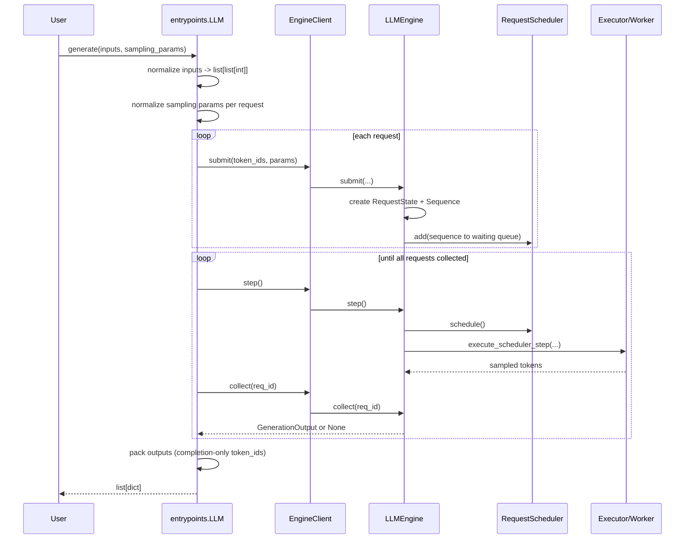
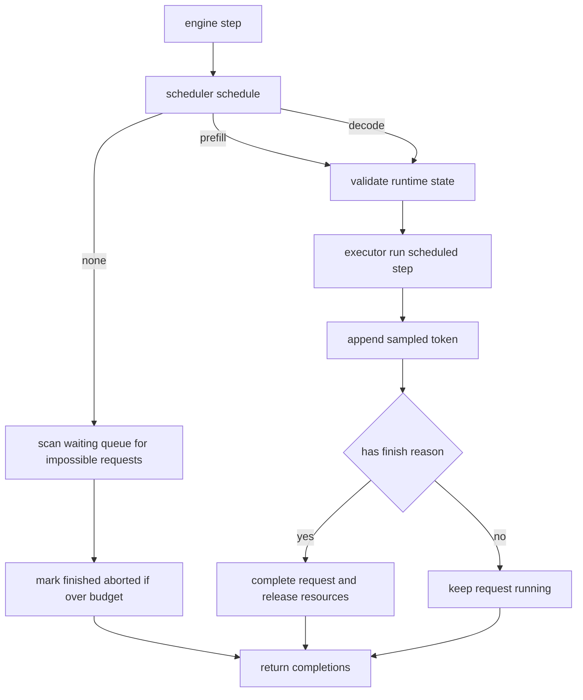
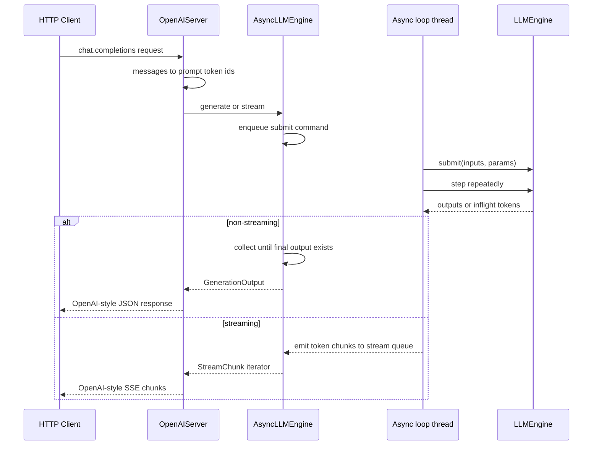

# Test Layout And Execution

This project now uses one unified entrypoint:

```bash
python scripts/run_tests.py --suite all
```

## Test Layers

- `stage0` (Core): C API/model/kernel correctness, KV semantics, adapter/model registry, infer baseline.
- `stage1` (Offline Engine): scheduler/executor/state machine, LLM entrypoint behavior, offline contract.
- `stage2` (Online + Sampling): sampling chain behavior, online server streaming/cancel/concurrency.
- `parity` (optional): compare against HF reference model outputs, requires local model path.

## Directory Layout

- `test/core/`: core C API + model/KV behavior tests
- `test/engine/`: scheduler/executor/state-machine/block-manager tests
- `test/offline/`: offline entrypoint/LLM interface tests
- `test/online/`: online server/API streaming/concurrency tests
- `test/parity/`: HF/reference parity tests
- `test/ops/`: low-level op tests
- `test/utils/`: shared testing helpers (e.g., batch builders)

## Standard Commands

- Run all fast suites (no parity by default if no model path):
```bash
python scripts/run_tests.py --suite all
```

- Run stage0 only:
```bash
python scripts/run_tests.py --suite stage0
```

- Run stage1 only:
```bash
python scripts/run_tests.py --suite stage1
```

- Run stage2 only:
```bash
python scripts/run_tests.py --suite stage2
```

- Run with parity enabled:
```bash
python scripts/run_tests.py --suite all --model-path ./models/DeepSeek-R1-Distill-Qwen-1.5B --run-parity auto
```

- Run HF-dependent infer check in stage0:
```bash
python scripts/run_tests.py --suite stage0 --model-path ./models/DeepSeek-R1-Distill-Qwen-1.5B --run-hf always
```

## Unified Entry

Use `scripts/run_tests.py` as the only orchestrator entrypoint.

## Design Principles

- One command path for CI/local runs.
- Fast tests and expensive parity tests separated by policy (`--run-parity`).
- Stage naming follows architecture milestones (`stage0`, `stage1`, ...).
- Existing tests stay intact; organization and execution are standardized first.

## Naming Convention

- File name: `test_<scope>_<subject>.py`
- Test case name: `test_<given>_<when>_<then>`
- Scopes:
  - `core`: C API/model decode/KV semantics
  - `engine`: scheduler/executor/state machine
  - `offline` / `online`: entrypoints and server contracts
  - `parity`: HF/reference parity checks
  - `ops`: operator-level behavior

## Batch Builder Convention

- For tests that call `llaisysModelDecode` or need BLOCK/SLOT batch assembly:
  - Use `test/utils/batch_builders.py::build_decode_batch`
  - Do not hand-write `LlaisysBatch` construction in new tests.
- Shared state for BLOCK cross-step mapping:
  - Use `BlockBatchState` when one logical request spans multiple decode calls.
- Rationale:
  - Keep SLOT/BLOCK semantics consistent across tests.
  - Avoid duplicated ctypes pointer-lifetime handling in every file.

## Runtime Sequence (Current)

### 1) Offline `LLM.generate(...)` (batch path)



Notes:
- `LLM.generate` no longer supports legacy single-token-list input (`list[int]`).
- Accepted forms are `str`, `list[str]`, and `list[list[int]]`.
- Return shape is always structured batch output (`list[dict]`), even for one request.

### 2) `LLMEngine.step()` scheduling branch



Key behavior aligned to current implementation:
- Prefill admission is attempted first; decode is fallback when no new prefill can be admitted.
- Request lifecycle is managed in `RequestState` (`waiting -> running -> finished_*`).
- Scheduler data (`waiting/running`) and block/KV bookkeeping live under `RequestScheduler` + `BlockManager`.

### 3) Online `OpenAIServer` request path



Online notes:
- `AsyncLLMEngine` uses a single background loop thread to mutate `LLMEngine` state.
- API thread only sends commands (`submit/collect/cancel/watch_stream`) through queues.
- This avoids concurrent direct mutation of scheduler/runtime state.
